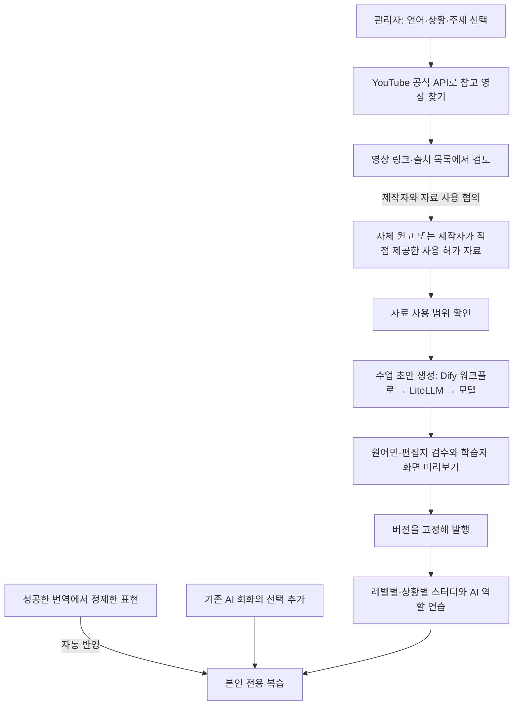

# 한마디 2.0 — 자료 수집과 수업 편집 관리자 설계

2026-09-29 · v0.2 · **설계 초안 / 관리자 화면·수집 기능 미구현**

사용자 요청: 영어·일본어·태국어·스페인어의 풍부한 회화 자료를 언어·상황별로 찾아 스터디에 반영한다. 기존 합의대로 디자인·목업을 검토하고 UI/UX 승인 후 실제 앱을 구현한다. 이 문서는 수집이나 발행을 실행하지 않는다.

최신 범위 결정: 초기 학습·번역은 현재대로 유지한다. 추가 학습은 **관리자의 공용 교재 발행 + 번역 내용의 개인 학습 자동 반영** 두 경로로 확장한다. AI 회화와 기존 선택 추가 기능은 유지하며 이번 변경에서 자동 수집 대상으로 확대하지 않는다.

## 1. 제안하는 구조

**관리자가 자료를 고르고, AI가 여러 회차의 수업 초안을 만들며, 검수한 수업만 학습자에게 공개한다.** LiteLLM은 모델 호출 창구다. 수업 콘텐츠가 쌓이고 개인별 추천이 개선되는 것을 모델 가중치의 자동 학습으로 표현하지 않는다. LiteLLM 공식 문서도 이를 모델 호출 라이브러리·게이트웨이로 설명한다. [LiteLLM](https://docs.litellm.ai/docs/)



YouTube 검색 결과가 그대로 수업 생성기에 들어가지 않는다. 검색 목록과 실제 수업 제작에 사용할 원문을 구분한다. 권한이 없는 영상도 참고 링크로 검토할 수 있지만 자막을 가져온 것처럼 처리하지 않는다.

## 2. 공식 API로 가능한 부분과 자료 확보 방식

2026-09-29 공식 문서 확인 기준이며 실계정 호출은 아직 하지 않았다.

| 단계 | 확인된 범위 | 설계 결정 |
|---|---|---|
| 영상 찾기 | `search.list`로 검색어·채널·언어 관련도·영상 카테고리 조건 검색 가능 | 공식 API로 제목·채널·영상 ID 등 후보를 표시 |
| 언어 선택 | `relevanceLanguage`는 언어를 엄격히 제한하지 않음 | 검색 언어와 실제 학습 대상 언어를 별도 필드로 관리. 한국어로 설명하는 태국어 강의도 분류 가능 |
| 자막 유무 | 자막 있는 영상 검색 가능 | 자막 존재와 자막 접근 권한을 별도 상태로 표시 |
| 자막 다운로드 | `captions.download`는 해당 영상 편집 권한과 OAuth 인증 필요 | 일반 공개 영상의 자막을 URL만으로 가져오는 기능은 제공하지 않음 |
| 수업 제작 원문 | API 접근 권한만으로 수업 재사용·AI 처리 허가가 확정되지 않음 | 자체 원고 또는 제작자가 직접 제공한 허가 자료를 우선 입력으로 사용 |

근거: [Search list](https://developers.google.com/youtube/v3/docs/search/list), [Captions download](https://developers.google.com/youtube/v3/docs/captions/download).

YouTube 개발자 정책에는 스크래핑, 허가 없는 시청각 콘텐츠 다운로드, API 데이터에서 파생 자료를 만드는 행위 등에 제약이 있다. 따라서 **OAuth로 접근 가능한 자막이라도 이를 AI 수업 생성·검색 지식으로 재사용할 수 있다고 자동 판정하지 않는다.** 관련 허용 범위는 `TODO(D1)`로 확인한 뒤 해당 경로를 열어야 한다. CC 표시나 제작자의 허가도 플랫폼 API 조건을 우회하는 수단으로 사용하지 않는다. [YouTube Developer Policies](https://developers.google.com/youtube/terms/developer-policies)

1차 제작 입력은 본인이 만든 대본, 강사와 계약해 직접 받은 SRT/VTT/텍스트, 적법한 사용 범위를 확인한 교재로 제한한다. 제작자 제공 자료에는 수업 가공·유료 서비스 제공·외부 AI 처리·검색 인덱싱·음성 제작 허용 범위를 각각 기록한다. 영상의 음성·음악·초상은 텍스트 권한에 포함됐다고 가정하지 않는다. 권한 있는 자료가 없으면 관리자가 주제와 의사소통 목표를 직접 적어 독립적인 예시 수업 초안을 만들 수 있다. 특정 영상을 분석했다고 표시하지 않는다.

## 3. 관리자 화면

탐색은 **자료 찾기 / 내 자료 / 수업 편집 / 검수·발행 / 학습 구성**으로 나눈다. 학습 앱의 네 개 하단 탭에는 관리 기능을 넣지 않는다.

### 자료 찾기

```text
자료 찾기                                  [검색]
학습 언어 [태국어 ▼]  강의 설명 언어 [제한 없음 ▼]
상황 [스몰토크 ▼]     세부 주제 [취미·주말 ▼]
목표 단계 [Lv.1–2]    검색어 [태국어 취미 회화      ]
채널/재생목록 [선택]  YouTube 카테고리 [전체 ▼]

영상 제목 · 채널 · 원문 링크
자막: 있음       자료 사용: 미확인
[YouTube에서 보기] [참고 목록에 담기]

자료를 제공받았다면 [내 자료 등록]
```

스몰토크·클럽은 한마디의 학습 상황이다. YouTube의 공식 영상 카테고리와 혼동하지 않도록 별도 필터로 둔다. 검색은 관리자 실행으로 시작하고 빈 결과·쿼터 초과·권한 오류·중복 후보 수를 보여준다. 정기 검색은 후속 범위로 두며 자동 수업 발행으로 연결하지 않는다.

### 내 자료 → 수업 편집

자료 등록에는 원문, 제공자, 관련 영상 링크(선택), 사용 근거, 허용 범위, 만료일, 실제 대상 언어, 지역·말투가 필요하다. 등록 자체와 사용 승인 상태를 구분한다.

```text
수업 초안 만들기
자료 [사용 범위 확인된 원고]     언어 [태국어]
상황 [스몰토크]                 세부 주제 [취미·주말]
단계 [Lv.1]                     수업 수 [3]
회차당 목표 [한 가지 의도 전달]  시간 [약 5분]
[초안 만들기]

원문 근거       수업 편집                  휴대폰 미리보기
출처·문단       뜻 / 표현 / 답변 분기       듣기 → 따라 말하기
사용 범위       발음 도움 / 말투 / 지역    → 상황에서 말하기
                [검수 요청]                → AI 역할 연습
```

각 문장은 원문 근거가 있는 부분과 AI가 새로 만든 연습 예시를 구분한다. 자료가 부족하면 목표 수량을 억지로 채우지 않고 보충 필요로 표시한다. 문장 수를 수업 수나 독립 주제 수로 부풀리지 않는다.

### 검수·발행

상태는 `자료 확인 대기 → 제작 가능 → 초안 → 검수 중 → 승인 → 발행`이다. 반려 시 수정 초안으로 돌아간다. 생성 실패·부분 성공·권한 만료는 별도 표시하고 실패 이유와 재시도 범위를 제공한다.

검수자는 뜻·자연스러움·발음 도움·말투·지역 차이·난이도·중복을 확인한다. 발행 전 실제 학습자 화면으로 듣기·답변 분기·도움·복습을 미리 본다. 수정은 새 버전으로 발행하고 학습 기록은 수강 당시 버전과 연결한다. 회수한 수업은 추천·AI 참고 자료에서 즉시 제외한다.

## 4. 스몰토크를 풍부하게 구성하는 방법

학습자는 **상황 → 세부 주제 → 단계별 수업**으로 탐색한다. 현재 목업의 상황별 대표 문장 한 개는 이 전체 커리큘럼을 대체하지 않는다.

| 세부 주제 | 첫 수업의 목표 | 다음 수업·응용 방향 |
|---|---|---|
| 자기소개 | 이름·어디서 왔는지 말하기 | 여행 이유 묻기, 상대 이야기 받아주기 |
| 취미·주말 | 좋아하는 활동 한 가지 말하기 | 빈도 묻기, 이유 붙이기, 공통 취미 찾기 |
| 음식·카페 | 좋아하는 음식 말하기 | 맛 표현, 추천 묻기, 취향 차이 설명 |
| 여행 | 방문한 곳 말하기 | 경험 나누기, 다음 일정 묻기 |
| 음악·공연 | 좋아하는 노래 말하기 | 장르·아티스트 묻기, 공연 경험 나누기 |
| 날씨·주변 풍경 | 지금 보이는 것에 말 걸기 | 느낌 묻기, 관련 경험으로 이어가기 |
| 일상 | 오늘 한 일 말하기 | 비슷한 경험 찾기, 공감 표현 |
| 대화 마무리 | 즐거웠다고 말하기 | 다시 만나자고 제안하기, 정중히 끝내기 |

위 목록은 초기 편집 방향이며 현재 제작 완료된 수업 수가 아니다. 단순히 같은 표현을 길게 늘리기보다 각 회차에 다른 목표와 상대 반응을 둔다. 예를 들어 ‘취미’는 **내 취미 말하기 → 상대에게 묻기 → 이유 붙이기 → 공통점이 없을 때도 대화 잇기**로 확장한다. 완전 초보는 한국어 뜻·선택 답변·원음으로 시작하고 외국어 타이핑을 요구하지 않는다.

클럽·바도 음악, 입장·자리, 음료 주문, 함께 즐기기, 정중한 거절, 친구 찾기, 귀가 등으로 나눈다. 언어마다 자연스러운 말투와 현지 맥락을 검수하고 한 언어의 원고를 단순 번역해 발행하지 않는다.

## 5. 공용 수업과 개인 학습의 연결

공용 수업에는 `언어 → 상황 → 주제 → 의사소통 목표 → 단계 → 회차` 분류를 둔다. 자동 반영된 번역 표현과 기존 AI 회화에서 사용자가 고른 개인 표현에도 같은 분류를 적용해 적절한 수업·복습을 추천한다. 개인 대화 원문을 공용 교재나 다른 사용자의 AI 지식으로 자동 편입하지 않는다.

예: 여행에서 ‘주말에 무엇을 하세요?’를 번역했다면 별도 저장 선택 없이, 본인의 ‘스몰토크 / 취미·주말’ 복습과 해당 단계의 ‘후속 질문하기’ 수업을 연결한다. 이 추천 결과와 사용자 연습 기록이 개인화 데이터이며 모델 재학습 데이터로 자동 전환되지 않는다.

AI 회화는 발행된 해당 언어·단계·상황의 수업과 표현만 검색해 참고한다(RAG). Dify는 검색·생성 흐름을 담당하고 LiteLLM은 모델 요청을 전달한다. 실제 모델 가중치를 바꾸는 파인튜닝은 별도 과제로 두며 1차 범위에 넣지 않는다.

### 번역 자동 반영 규칙

- 번역 결과는 먼저 전달하고, 성공한 양방향 번역에서 개인 학습 표현을 정제해 자동 반영한다. 초기 학습·번역 조작은 유지하고 종료 시 선택 저장 단계를 제거한다.
- 번역 화면에서 자동 반영을 안내하며 설정에서 끌 수 있다. 끈 동안의 번역을 소급 수집하지 않는다. 반영된 표현은 본인이 확인·삭제한다.
- 같은 사용자·언어·의도의 중복 표현은 복습을 중복 생성하지 않는다. 화자와 듣기·말하기 목적은 구분한다. 번역 사용 사실로 숙달이나 실력 부족을 단정하지 않는다.
- 실패·비어 있는 결과·민감정보·확인되지 않은 뜻은 정답 수업에 자동 반영하지 않는다. 개인 대화는 공용 교재에 자동 합치지 않는다.
- 작업 상태는 준비 중·완료·실패로 표시하고 하루 학습 시간에 맞춰 배분한다. 삭제·자동 추가 해제와 늦은 작업 결과가 충돌하면 새 저장을 거부한다. 자동 추가 해제는 기존 저장 표현의 삭제와 구분한다.
- 실제 정제·분류·비동기 저장은 설계 단계다. 목업에서는 개인정보 없는 예시 표현의 자동 추가·중복 방지·끄기·삭제·언어 격리만 체험한다.

## 6. 데이터·운영 경계

- `ReferenceVideo`: 공식 API 영상 ID·출처·메타데이터 확인 시각·갱신/삭제 기한. LLM 입력에 자동 포함하지 않는다.
- `SourceMaterial`: 직접 제공된 원문·제공자·사용 근거·허용 범위·만료일·콘텐츠 해시. API 데이터와 저장소를 구분한다.
- `LessonDraft/Version`: 원문 연결·생성 모델/프롬프트 버전·검수 기록·발행 상태·언어/단계/주제.
- `PersonalPractice`: 사용자별 표현·도움 사용·복습·수업 버전. 사용자 간 접근을 차단한다.

편집·검수·발행 권한은 서버에서 검사한다. 외부 자료의 명령은 시스템 지시로 실행하지 않고 인용 자료로만 취급한다. 중복 요청은 작업 ID와 자료 해시로 제어한다. 생성 비용·검색 쿼터·실패 건수를 작업별로 남기되 원문·키를 일반 로그에 노출하지 않는다. 모델 비용과 API 한도는 실제 설치 버전·프로젝트에서 확인하며 추정값을 확정 수치로 표시하지 않는다.

API 데이터는 해당 정책에 따라 갱신·삭제한다. 저작권 허가 철회·사용 기간 만료 시 연결 수업을 회수하고 검색 인덱스·캐시·재생성 대상을 함께 정리한다. 개인 학습 기록에서도 회수된 자료를 다시 노출하지 않는다. 백업 삭제·보존 범위는 출시 전 확정한다.

## 7. 다음 목업과 구현 수용 기준

다음 디자인 보완은 학습자 **스몰토크 세부 주제 → 회차 목록**과 관리자 **자료 찾기 → 제공받은 자료 등록 → 수업 편집 → 검수·발행 미리보기**다. 관리자 목업의 발행은 화면 체험임을 표시하며 실제 데이터·API·계정 권한을 변경하지 않는다.

실제 구현 전에 확인할 항목:

1. 네 언어 모두 주제·회차를 탐색하고 다른 언어 기록과 섞이지 않는다.
2. 검색에 나타난 일반 영상의 자막에 접근할 수 없으면 상태·이유가 보이며 수업 생성으로 넘어가지 않는다.
3. 원문 없이 영상 제목만 있는 항목은 ‘영상 내용 기반 수업’으로 표시되지 않는다.
4. 자료 사용 승인·콘텐츠 검수가 빠진 초안은 발행할 수 없다. 취소·반려·회수도 검증한다.
5. 영어·일본어·태국어·스페인어별로 초보자가 듣기와 말하기만으로 실제 수업을 완료하는지 확인한다.
6. 번역한 표현이 선택 저장 없이 개인 복습으로 연결되고 기존 AI 선택 추가도 유지된다. 개인 대화가 공용 콘텐츠에 유출되지 않는다. 끄기·중복·실패·삭제·언어 격리를 검증한다.
7. `TODO(D1)`: API 데이터의 AI 처리·가공 허용 범위, OAuth 검증, 실제 쿼터, 자료별 사용 조건, 보관·삭제를 확인한다. 미확인 경로는 열지 않는다.

현재 검증: 공식 문서의 검색·자막 접근 조건을 확인하고 설계에 반영했다. 실제 YouTube 검색 호출, 자료 가져오기, AI 생성, 관리자 인증·발행 테스트는 아직 수행하지 않았다.
