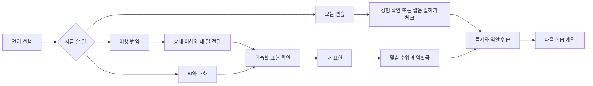
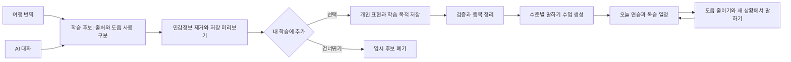
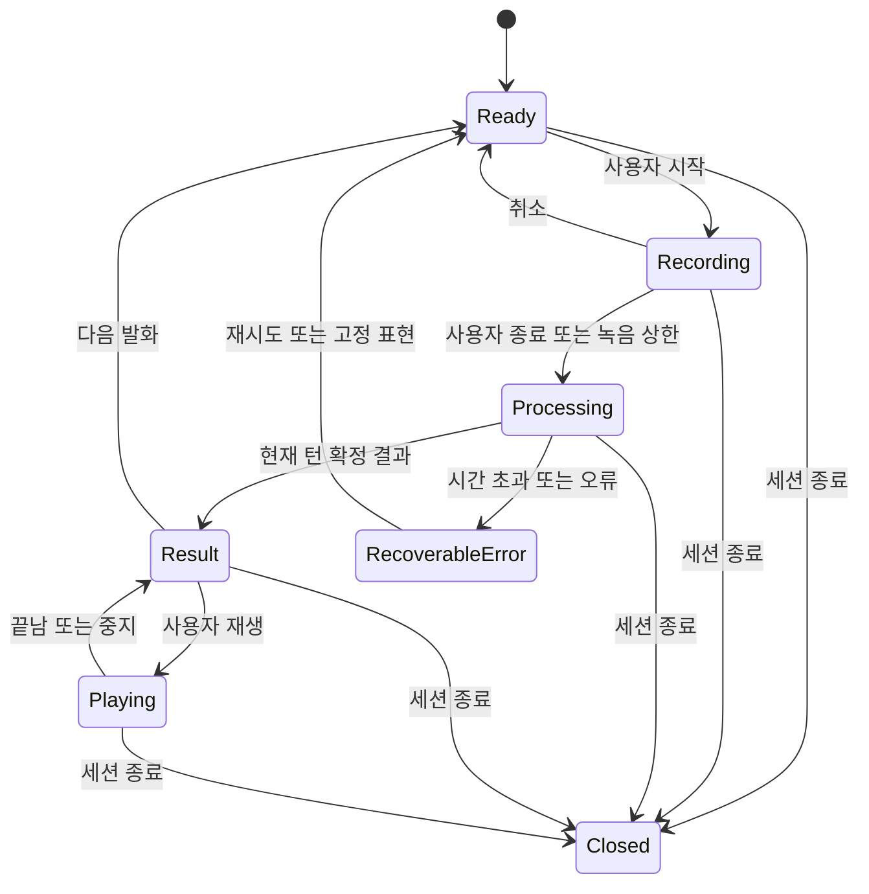
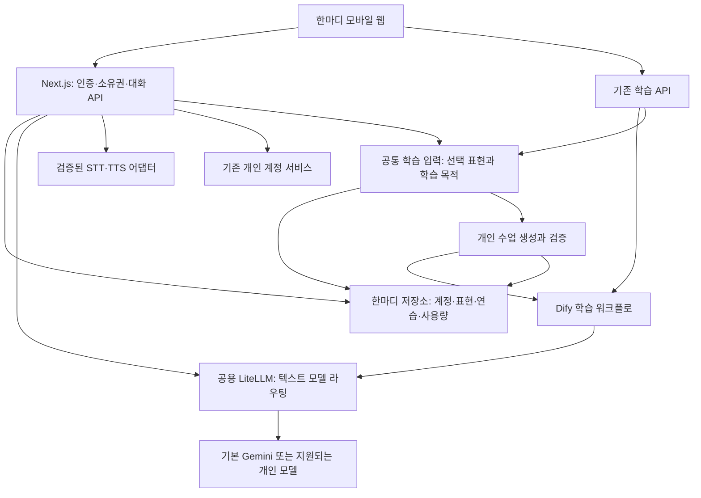

# 한마디 — 말하기 학습과 실전 대화를 연결하는 앱 설계안

작성일: 2026-09-29 · 버전: 0.2 · 상태: **구현 전 제안 / 검토용**

0.2 변경: 여행 현장의 번역과 AI 대화를 동일한 개인 학습 재료로 연결한다. 말하기 중심의 체계적인 수업, 자유 AI 회화, 실전 번역을 제공하고 두 대화 출처에서 나온 표현·막힌 부분을 다음 수업과 복습에 반영한다. §19에서 독립 앱 신설과 한마디 개편을 비교하고 **기존 기반을 재사용하는 한마디 2.0 전면 개편**을 권고한다.

이 문서는 제품·UX·기술 설계다. 문서 작성은 기능 구현, 인프라 추가, 공급자 계약 변경, 운영 배포 승인을 뜻하지 않는다. 아래 목표 수치·보관 기간·출시 범위는 제안이며 현재 성능이나 확정된 공급자 한도가 아니다.

## 1. 제품 방향과 이번에 결정할 내용

**지금은 도움받아 대화하고, 다음에는 같은 말을 스스로 하게 돕는다.** 외국어를 읽거나 쓰지 못해도 시작할 수 있어야 한다. 공부한 내용을 실제 대화에 쓰고, 실제 대화에서 막힌 내용을 다음 공부로 가져온다.

설계 권고안은 다음과 같다.

| 결정 | 권고안 | 이유 |
|---|---|---|
| 첫 사용자 | 한국어 사용자 중 일본어 완전 초보·여행 회화 입문자 | 사용 상황과 성공 기준을 구체적으로 검증 가능 |
| 첫 실전 환경 | 휴대폰 한 대로 마주 보고 대화 | 상대 앱 설치 없이 사용 가능 |
| 첫 실전 언어 | 한국어 ↔ 일본어 | 카페·식당·쇼핑으로 품질 검증 범위 제한 |
| 기존 학습 | 한국어·일본어·태국어 학습 유지 | 새 기능 때문에 기존 학습을 축소하지 않음 |
| 입력 방식 | 큰 버튼을 눌러 시작하고 다시 눌러 끝내는 음성 입력 | 계속 누르고 있을 필요 없이 화자·언어를 명확히 구분 |
| 출력 방식 | 한국어 뜻 → 따라 말할 발음 도움 → 원문·음성 | 외국어 문자를 읽지 못해도 행동 가능 |
| 앱 형태 | 설치 가능한 모바일 웹(PWA)부터 검증 | 기존 Next.js 자산 활용, 실제 사용 검증 후 네이티브 판단 |
| 개인화 | 표현별 연습 이력·도움 사용·복습 결과 | LLM 자체 재학습 없이 개인에게 맞는 학습 제공 |
| 성공 기준 | 대화 목적 달성, 다음 날 도움 없이 표현하기 | 채팅 수·번역 수와 학습 성취를 구분 |

가정: 이번 1차 범위는 **대면 대화**다. 전화·LINE·영상통화의 상대 음성 수집은 포함하지 않는다. 향후 요구가 원격 통화 중심으로 바뀌면 음성 경로와 앱 형태를 별도 재설계한다.

### 1.1 제품 정체성 — 여행과 AI 대화가 내 교재가 되는 말하기 앱

사용자 요구는 **Speak 같은 말하기 학습 + Google Translate 같은 현장 번역 + 두 경험을 잇는 개인화**다. AI 자유 대화도 별도 채팅 기록으로 끝내지 않고 같은 학습 흐름에 포함한다.

| 경험 | 사용자의 목적 | 학습으로 이어지는 재료 |
|---|---|---|
| 체계적인 스터디 | 처음부터 한 단계씩 말하기 익히기 | 검수된 기본 과정, 실제 연습 결과 |
| AI와 대화 | 부담 없이 자유 주제·여행 상황 연습 | 말하고 싶었지만 몰랐던 표현, 도움 요청, 확인된 수정 사항 |
| 여행 중 번역 | 현장에서 상대를 이해하고 내 뜻 전달 | 실제 필요했던 표현, 다시 듣거나 저장한 질문·답변 |
| 맞춤 복습 | 다음에는 같은 말을 스스로 하기 | 위 재료를 수준·시간에 맞춘 짧은 수업과 역할극 |

참고 제품의 공식 설명을 2026-09-29 확인했다. Speak는 맞춤 말하기 수업과 대화 연습을, Made For You는 연습 중 실수·관심사에 따른 맞춤 수업을 안내한다. Google Translate는 음성 번역과 마주 보기 화면을 안내한다. 여기서 가져오는 것은 사용 목적과 흐름이며, 이들 앱의 콘텐츠·계정·기록을 가져오거나 그대로 복제하는 설계가 아니다. [Speak Tutor](https://help.speak.com/en/articles/11396739-what-is-speak-tutor), [Made For You](https://help.speak.com/en/articles/11565779-what-are-made-for-you-custom-lessons), [Google Translate 음성 번역](https://support.google.com/translate/answer/6142474?co=GENIE.Platform%3DAndroid&hl=en).

**한마디 안에서 수행한 번역과 AI 회화**가 입력이다. Google Translate 앱의 기록 연동이나 Speak 콘텐츠 사용을 전제로 하지 않는다. Google Translate의 앱 기능 안내를 동일한 공개 API·한도·성능의 제공 근거로 쓰지 않는다. 실시간 번역의 최종 목표는 자연스러운 음성 대화이며, 첫 단계의 발화 단위 번역과 이후 스트리밍 검증은 §10에 구분한다.

## 2. 현재 기반과 새로 필요한 부분

현재 상태는 2026-09-28 운영 QA와 배포 기준 소스 `e978ba317361d90f9f84e96f32534d022ce00ecb`를 근거로 한다. 이 문서를 쓰면서 운영 재배포·실호출 검사를 다시 수행한 것은 아니다.

| 현재 확인된 기반 | 활용 / 필요한 변경 |
|---|---|
| 언어 선택, 완전 초보의 듣기→따라 말하기→상황 연습 | 오늘 연습의 기본 흐름으로 유지 |
| 일본어·태국어 음성 인식·Gemini 회화·TTS 실호출 QA | 음성 어댑터 재사용 후보. 실제 휴대폰·사람 음성 검증 추가 |
| 한글 발음 도움, 느리게 듣기, 주간 계획 | 표현 단위의 실전 복습과 연결 |
| Vercel Next.js + GCP 공용 LiteLLM·Dify·계정 서비스 | 기존 서비스 위치 유지, 실전 API는 별도 모드로 추가 |
| 기본 Gemini, Codex 연결, Claude API 키 연결 | 학습 모드의 선택 기능 유지. 개인 모델의 실응답 검증은 계정 인증 후 필요 |
| 튜터 로그인·학생 공유 링크 중심 권한 | 개인 학습자 계정·데이터 소유권을 먼저 추가해야 함 |
| Redis/파일 저장소 드라이버 | Redis 기반 운영 저장소를 재사용하는 방향. 실제 설정·백업·원자적 쓰기 지원은 착수 시 확인 |
| `/live` 수업 노트, `/meet` 튜터 소개 | 실전 통역 화면으로 덮어쓰지 않음. 각각 기존 목적 유지 |
| 기존 번역 API는 튜터의 한국어→영어 표현 보조 | 실전 양방향 대화 API로 간주하지 않음 |

기존 QA에 태국어 자유 회화 504와 생성된 발음 도움의 불일치가 기록돼 있다. 따라서 현재 학습 응답 경로를 그대로 실전 대화의 속도·품질 보장으로 사용하지 않는다.

근거: [말하기 운영 QA](qa/20260928-hanmadi-speaking-production.md), [모델 연결 운영 QA](qa/20260928-hanmadi-account-production.md). 기준 소스: [학습 로직](https://github.com/hhj4861/commerce-automation-kit/blob/e978ba317361d90f9f84e96f32534d022ce00ecb/apps/hanmadi/lib/adaptive-learning.ts), [학생 권한](https://github.com/hhj4861/commerce-automation-kit/blob/e978ba317361d90f9f84e96f32534d022ce00ecb/apps/hanmadi/lib/students.ts), [저장소](https://github.com/hhj4861/commerce-automation-kit/blob/e978ba317361d90f9f84e96f32534d022ce00ecb/apps/hanmadi/lib/store.ts).

## 3. 사용자와 성공 장면

| 사용자 상태 | 필요한 도움 | 성공 장면 |
|---|---|---|
| 일본어를 전혀 모름 | 한국어 뜻, 짧은 답변 선택, 발음·음성 | 점원의 질문을 이해하고 원하는 방식으로 주문 |
| 몇 문장을 외웠지만 상대 말을 못 알아들음 | 상대 발화 이해, 되묻기 | 대화가 막혀도 다시 이어감 |
| 연습한 말은 할 수 있으나 응용이 어려움 | 상황·수량을 바꾸는 연습 | 외운 문장과 다른 상황에서도 표현 |

사용자는 언제든 음성 재생으로 의사를 전달할 수 있다. 직접 말하기를 강요하거나 도움을 사용했다는 이유로 감점하지 않는다. 실전 도움은 대화 성공으로, 독립 발화는 별도 학습 증거로 기록한다.

## 4. 정보 구조와 첫 진입

하단 탭은 **스터디 / AI 대화 / 번역 / 내 표현**으로 구성한다. 스터디의 첫 화면은 오늘 연습이다. AI 상대와의 연습과 실제 사람의 말을 옮기는 번역은 버튼·화면에서 명확히 구분한다. 계정·언어·음성·개인 AI 설정은 상단 프로필에 모은다. 모델 선택을 첫 진입 단계로 요구하지 않는다.



- 첫 로그인 후 학습 언어를 선택한다. 이후 마지막 선택을 유지하고 화면에 항상 표시한다.
- 오늘 연습에서는 “처음이에요”로 바로 시작하거나 짧은 듣기·말하기 체크를 선택한다. 쓰기 시험은 진입 조건이 아니다.
- 급한 실전 대화에서는 레벨 체크를 건너뛸 수 있다. 학습 수준이 없어도 최대 도움으로 대화를 시작한다.
- 학습 수준·진행·저장 표현은 언어별로 분리한다. 대화 중 언어 변경은 현재 녹음·재생을 끝낸 뒤 새 세션으로 진행한다.
- 기존 사용자의 학습 정보는 유지한다. 개인 학습자 계정 전환을 이유로 기존 튜터 권한을 자동 부여하지 않는다.
- 첫 화면에서 여행 중이면 번역을 바로 열 수 있고, AI 대화는 주제를 고르거나 한국어로 원하는 상황을 말해 시작한다. 여행 일정·GPS 입력은 필수가 아니다.

## 5. 오늘 연습 — 쓰기 없이 가능한 학습

기본 5분 연습은 다음 순서로 구성한다. 5분은 UX 제안이며 기존 10/15/20분 계획을 덮어쓰지 않는다. 설정에 짧은 연습을 추가하고 남은 학습 시간에 맞춰 제시한다.

1. **뜻 알기:** 한국어로 상황과 표현의 용도를 듣거나 읽는다.
2. **소리 듣기:** 자연 속도와 느린 속도로 한 표현을 듣는다.
3. **따라 말하기:** 발음 도움을 보며 말한다. 녹음하지 않고 직접 연습하기도 가능하다.
4. **상황에서 꺼내기:** AI가 질문하면 뜻·첫 소리·완성 문장 순서로 필요한 만큼 도움받는다.
5. **변형하기:** 음료·수량·장소를 바꿔 말한다. 입문자는 선택으로 바꿀 수 있다.
6. **다음 연습 정하기:** “다시 듣고 싶어요 / 보고 말했어요 / 없이 말했어요”로 마무리한다.

음성 인식 실패는 언어 실력 실패로 처리하지 않는다. 인식 결과를 사용자가 확인·재시도할 수 있게 하고, 평가할 수 없는 시도는 `unscored`로 둔다. 정밀 발음 점수는 별도 검증 전까지 제공하지 않는다.

한글 표기는 **발음 도움**으로 명명한다. 일본어의 장음·촉음, 태국어의 성조를 한글만으로 정확히 표현한다고 주장하지 않는다. 고정 표현은 원어민 검수와 원음 재생을 함께 제공하고, 생성형 표기는 미검수 상태를 구분한다.

### 5.1 체계적인 과정과 개인 맞춤 수업

스터디는 자유 채팅만 제공하는 화면이 아니다. 인사·요청·주문·수량·되묻기 등 단계별 말하기 목표가 있는 기본 과정과 개인 대화에서 만든 짧은 수업을 함께 제공한다. 여행이나 AI 대화를 한 적이 없어도 기본 과정으로 계속 학습할 수 있다.

오늘 연습에는 “어제 번역한 주문 표현”, “AI 대화에서 도움받은 길 묻기”처럼 추천 이유를 표시한다. 계획은 §7의 우선순위와 사용자가 정한 총시간 안에서 조절하고, 개인 표현만 반복해 기초 과정이 사라지지 않도록 기본 과정도 남긴다. 부족한 문법은 말하기에 필요한 한 가지 패턴으로 짧게 설명하고 바로 소리 내어 써 본다.

### 5.2 AI와 대화 — 자유 대화와 역할극

- **시작:** 자유 주제 또는 카페·식당·호텔·길 묻기 같은 상황을 고른다. 완전 초보는 한국어로 시작하고, AI가 짧은 목표 언어 문장과 뜻·발음 도움을 제공한다.
- **진행:** 사용자가 말할 기회를 확보하도록 AI의 발화를 수준에 맞게 짧게 제한한다. “한국어로 도와줘 / 다시 들려줘 / 어떻게 말해?”를 언제든 사용한다.
- **피드백:** 대화 도중에는 의미 전달에 꼭 필요한 수정만 짧게 보여주고 자세한 설명은 종료 후로 미룬다. 방언·다른 자연스러운 표현을 무조건 오답 처리하지 않는다.
- **학습 신호:** 사용자가 요청한 표현, 도움 사용, 말하려던 의도, 확인된 표현 수정, 관심 주제를 모은다. AI가 말한 문장은 사용자 발화·실수·숙달 증거와 분리한다.
- **종료:** 번역과 동일하게 최대 세 개의 학습 후보를 보여주고 “내 학습에 추가” 한 번으로 저장·수업 준비를 시작한다. 바로 연습하거나 나중에 스터디에서 이어 할 수 있다.

기존 튜터용 AI 회화 기록의 보관 정책은 그대로 설명한다. 새 개인 학습자 AI 대화 경로는 종료 시 학습용 후보만 선택 저장하는 정책을 적용하며, 기존 Dify 대화가 자동 삭제된다고 주장하지 않는다. 새 경로의 Dify·공급자 보관 설정은 공개 파일럿 전에 확인한다.

## 6. 번역 — 한 대의 휴대폰으로 여행 현장 대화

### 6.1 상대 말을 이해하기

사용자가 “상대 말 듣기”를 누르면 일본어 입력으로 시작한다. 상대에게 보이는 안내에 음성을 번역 서비스로 처리한다는 점을 표시하고 동의를 확인한다. 처음 사용 시에만 안내 방법을 자세히 설명한다.

인식이 끝나면 **한국어 뜻을 가장 크게**, 원문은 접거나 작게 보여준다. 지원되는 경우 중간 자막은 “듣는 중”으로 표시하고, 답변 후보는 확정된 발화에만 연결한다. 1차 버전에서 중간 자막을 제공하지 못하면 기다리는 상태를 명확히 보여준다.

예시 화면의 일본어·발음은 설명용 초안이며 출시 전 원어민 검수 대상이다.

```text
일본어 · 카페                         종료

상대가 한 말
“매장에서 드시나요?”
원문 보기 ▾

이렇게 답할 수 있어요
[여기서 먹을게요]  [포장해 주세요]
[직접 한국어로 말하기]

[ 상대 말 듣기 ]    [ 내 말 전달하기 ]
다시 말씀해 주세요 · 천천히 부탁드려요
```

### 6.2 내가 답하기

한국어로 표시한 후보를 선택하거나 “내 말 전달하기”에서 한국어로 말한다. 사용자 뜻을 일본어로 바꾸되, 가격·수량·날짜·이름·알레르기 등 중요한 내용을 임의로 보충하지 않는다.

```text
내가 전달할 뜻
여기서 먹을게요

하이, 코코데 타베마스
はい、ここで食べます。

[천천히 듣기]  [상대에게 들려주기]
[크게 보여주기] [표현 저장]
```

- 재생은 사용자의 선택으로만 시작한다. 추천 답변을 상대에게 자동으로 말하지 않는다.
- 사용자가 직접 말할 때는 마이크를 켜지 않아도 된다. 실제 전달 성공 여부는 사용자가 선택해 기록한다.
- “천천히 듣기”도 스피커로 나올 수 있음을 고려한다. 무음 발음 보기·상대에게 크게 보여주기를 함께 제공한다.
- 마주 보기 화면은 상대에게 전달할 원문만 크게 보여주며 개인 학습 수준·과거 기록·계정 정보는 숨긴다.
- 후보가 없거나 모호하면 “다시 말씀해 주세요”와 한국어 직접 입력을 제공한다. 답을 억지로 생성하지 않는다.
- 숫자·통화·시간 표현은 원문과 번역에서 함께 강조하고 사용자가 확인한 뒤 전달한다.
- 번역은 실제 발화의 뜻을 전달한다. 학습 수준에 맞춰 정보를 생략하거나 원문에 없는 친절한 답을 섞지 않는다. “이렇게 답할 수 있어요”는 번역 결과와 구분하며, 학습용 쉬운 표현은 스터디에서 별도로 만든다.

### 6.3 대화 종료와 복습 연결

대화 종료 즉시 마이크·재생·실시간 연결을 중단한다. 방금 본 표현 중 **최대 세 개를 제안**하고 사용자가 “내 학습에 추가”로 골라 저장한다. 선택한 뒤의 수업 생성·일정 반영은 자동으로 진행한다. 저장하지 않고 끝내는 선택을 같은 수준으로 제공한다. 현장에서 번역할 때마다 퀴즈나 저장 팝업을 띄우지 않는다.

전체 대화 로그를 기본 저장하지 않는다. 저장할 표현은 개인 이름·주소 등 불필요한 정보를 제거하거나 바꾼 미리보기를 보여준다. 사용자가 선택한 표현만 내 표현에 반영한다. 세션이 만료됐거나 앱이 종료돼 복습 후보를 복구할 수 없으면 이를 알리고, 저장된 표현은 별도로 유지한다.

종료 시 서버의 대화 문맥은 삭제하고, 종료 직전에 화면에 있던 표현 후보만 클라이언트 메모리의 저장 초안으로 남긴다. 이 초안은 localStorage에 넣지 않고 종료 화면을 벗어나거나 5분이 지나면 폐기한다. 저장은 사용자가 고른 문장으로 새 SavedPhrase를 만드는 동작이며, 삭제한 실전 세션을 다시 여는 동작이 아니다. 서버 삭제가 실패하면 재시도 상태를 알리고 세션 종료 표식으로 추가 처리를 차단한다.

## 7. 내 표현과 개인화 규칙

표현 카드는 한국어 뜻, 학습 언어, 발음 도움, 원문, 듣기, 연습 시작, 출처 상황을 가진다. 원문의 문자 입력 없이 카드 선택·음성으로 모든 핵심 기능을 사용할 수 있다.

| 기록 | 의미 | 학습 계획에 미치는 영향 |
|---|---|---|
| `assisted` | 번역·답변·음성 도움으로 실전에서 사용 | 다음 연습 후보가 됨. 숙달로 승급하지 않음 |
| `repeated` | 듣고 따라 말함 | 같은 표현을 나중에 힌트 없이 재시도 |
| `hinted` | 일부 힌트로 역할 연습 | 다음 연습에서 힌트를 줄여 제시 |
| `independent` | 답을 보거나 듣기 전 스스로 시도 | 평가 출처·확실성을 함께 저장. 자동 숙달 확정 아님 |
| `unscored` | 인식 실패·기기 문제·녹음 없는 자기 보고 | 재시도·시간 배분에만 반영 |

복습 간격 초안: 도움받은 표현은 다음 학습일, 독립 시도에 성공한 표현은 3일 뒤, 다른 날 다시 성공하면 7일 뒤에 제안한다. 한 번의 성공으로 언어 전체 수준을 올리지 않는다. 간격은 학습 설계 가설이며 사용성·회상 실험 후 조정한다.

일일 계획은 **복습 기한이 된 어려운 표현 → 최근 실전에서 저장한 표현 → 새 상황** 순으로 배분한다. 복습만 계속 쌓이지 않도록 하루 새 표현 수와 총 시간을 제한한다. 사용자가 요일·시간을 바꾸거나 쉬어도 실패·연속 기록 상실로 압박하지 않는다.

`assistanceUsed`, 평가 출처(`self`/`system`/`human`), 실제 연습과 미래 일정 예측을 분리해 저장한다. “도움 없이 말했다”는 자기 보고와 검증된 독립 수행을 같은 점수로 합치지 않는다. 기존 수준은 연습 난이도로 활용하고, 공인 언어 등급처럼 표시하지 않는다.

### 7.1 번역·AI 회화 공통 학습 흐름



여기서 “학습한다”는 **사용자의 경험으로 개인 교재와 계획을 갱신한다**는 뜻이다. LiteLLM 또는 기반 모델의 가중치를 매번 재학습하는 기능이 아니다. 개인화를 위해 모든 원문 기록을 장기 보관하거나 벡터 DB를 처음부터 도입할 필요는 없다. 1차는 소유자·언어·상황·연습 상태로 필요한 표현만 조회해 수업 입력으로 사용한다.

1. **후보 추출:** 번역은 실제 필요했던 말·반복 요청·저장한 표현을, AI 회화는 도움 요청·명시적 학습 요청·확인된 수정 사항을 후보로 만든다. 여행 번역을 사용했다는 사실만으로 해당 표현을 모른다고 확정하지 않는다.
2. **출처·용도 분리:** `travel_translation`과 `ai_conversation`, 사용자/상대/AI 화자, 말하기/듣기 목표를 구분한다. 상대가 한 질문은 듣기 연습에, 사용자가 하고 싶었던 말은 말하기 연습에 우선 활용한다.
3. **선택 저장:** 원문 전체 대신 일반화한 짧은 표현과 상황·의도만 미리 보여준다. 이름·예약번호·정확한 숙소·결제 정보는 제외한다. 후보는 기본 체크하지 않으며 선택한 항목만 영속 저장한다.
4. **정확성 확인:** 인식 불명확·번역 방향 오류·의미가 달라진 수정은 자동 출제하지 않는다. 뜻이 맞는지 한국어로 확인하거나 보류한다. 자동 형식 검증 통과를 원어민 검수 완료로 표시하지 않는다.
5. **수업 생성:** 짧은 핵심 표현, 한국어 설명, 음성·발음 도움, 상대 질문 듣기, 따라 말하기, 역할극, 한 가지 변형을 만든다. 입문자는 한 문장, 중급자는 이어 말하기로 난이도를 조절한다.
6. **반영·복습:** 생성 완료 시 스터디에 추천 이유와 함께 추가한다. 실패하면 저장 표현은 보존하고 “수업 준비 실패 · 다시 만들기”로 알린다. 실제 연습 결과로만 복습 시점을 조절한다.

### 7.2 여행과 AI 대화가 같은 수업으로 연결되는 예

| 단계 | 사용자 경험 | 시스템 처리 |
|---|---|---|
| 여행 번역 | 카페에서 “덜 달게 해 주세요”를 번역해 전달 | 주문 상황·의도·도움 사용을 후보로 제시 |
| AI 대화 | 음료 주문 역할극에서 “얼음은 조금만”을 한국어로 질문 | 다른 출처의 주문 표현을 후보로 제시 |
| 학습에 추가 | 두 표현을 각각 선택 | 개인정보 없는 표현과 출처만 저장 |
| 오늘 스터디 | “내가 주문할 때 필요했던 표현 · 5분” | 듣기→따라 말하기→점원과 역할극으로 구성 |
| 다음 복습 | 단맛·얼음 양을 바꿔 도움 없이 주문 | 새 상황에서의 독립 시도와 도움 사용을 분리 기록 |

이는 수업 구성 예시이며 검증된 학습 효과나 번역 문구가 아니다. 한 번에 외울 표현을 늘리기보다 실제 필요했던 짧은 표현을 다시 꺼내 말하게 한다.

### 7.3 중복·오류·과부하 방지

- 동일 사용자의 같은 언어·뜻·사용 맥락에 맞는 표현은 출처를 추가하고 수업을 중복 생성하지 않는다. 부정·수량·높임·의도가 다르면 별개로 유지하며 문자열 유사도만으로 합치지 않는다.
- “이미 알아요 / 지금은 필요 없어요 / 뜻이 달라요”로 추천을 조정한다. 이미 안다는 자기 보고는 추천 빈도에만 반영하며 검증된 숙달로 기록하지 않는다.
- 여행 번역과 AI 회화의 후보 수를 합쳐 하루 학습 시간 안에서 배분한다. 밀린 항목은 실패로 표시하지 않고 다음 계획으로 넘기거나 사용자가 제외한다.
- 원본 표현이 수정되면 해당 revision으로 만든 수업을 재검증한다. 삭제 시 연결된 개인 수업·복습 항목도 제거하고, 두 출처가 합쳐진 표현은 출처 하나 제거와 표현 전체 삭제를 구분해 안내한다.
- 학습 후보·수업 생성은 번역 응답이나 AI 회화 응답을 기다리게 하지 않는다. 첫 출시는 명시적 추가 요청에서 생성하고, 긴 처리가 필요하면 저장된 상태로 재개 가능한 앱 내부 작업으로 확장한다.

## 8. 앱 화면·접근성 원칙

- 핵심 조작은 한 손 엄지 범위, 터치 영역 목표 48 CSS px 이상. 긴 누르기만으로 동작하는 기능 금지.
- 360px 폭, 글자 확대 200%, 밝은 야외·어두운 실내에서 핵심 버튼과 뜻을 확인 가능하게 설계한다.
- 상태는 색뿐 아니라 문구·아이콘으로 표시한다. 선택적 진동은 지원 기기에서만 보조로 사용한다.
- AI 제공자·모델·토큰 등의 기술 설정은 프로필 안에 둔다. 실전 대화 화면은 듣기·전달·종료에 집중한다.
- 마이크 거부 시 한국어 텍스트·고정 표현·크게 보여주기를 제공한다. “설정하세요”만 표시하고 막지 않는다.
- 휴대폰 잠금·백그라운드 전환 시 녹음을 중단하는 전경 사용을 1차 기준으로 삼는다. 돌아오면 사용자 선택으로 재개한다.
- 음성 재생 중 마이크 수집을 중단해 앱의 목소리를 상대 말로 다시 처리하지 않는다. 이어폰 연결 변경 시 새 재생 전에 출력 경로를 확인할 수 있게 한다.
- 별표로 저장한 공개 고정 표현과 음성은 다운로드 기능으로 오프라인 제공할 수 있다. 실시간 번역·새 AI 답변은 인터넷이 필요하다고 명확히 표시한다.

PWA 설치 지원은 브라우저·OS마다 다르다. HTTPS·manifest 등 설치 조건은 공식 문서를 따르고 실제 iOS/Android에서 검증한다. 웹 마이크는 보안 컨텍스트와 사용자 권한이 필요하다. [MDN PWA 설치](https://developer.mozilla.org/en-US/docs/Web/Progressive_web_apps/Guides/Making_PWAs_installable), [MDN getUserMedia](https://developer.mozilla.org/en-US/docs/Web/API/MediaDevices/getUserMedia).

## 9. 음성 상태와 실패 처리



| 상황 | 사용자가 보는 동작 | 처리 규칙 |
|---|---|---|
| 잘 안 들림·무음 | “잘 듣지 못했어요. 다시 들어볼까요?” | 틀린 번역을 확정하지 않음. 숫자 confidence가 없으면 지어내지 않음 |
| 둘이 동시에 말함 | 화자를 나눠 말하도록 안내 | 1차 버전에서 자동 화자 분리 정확성을 약속하지 않음 |
| 느린 응답 | 처리 상태와 취소·고정 표현 | 이미 들은 음성을 자동 재전송하지 않음 |
| 연결 끊김 | 마지막 확정 결과 유지, 새 녹음은 명시적 재시도 | 끊긴 동안의 음성을 몰래 저장·나중 전송하지 않음 |
| 추천 생성 실패 | 번역 결과는 유지, 한국어 직접 말하기 가능 | 번역과 추천 실패를 분리 |
| 음성 생성 실패 | 문장·발음 도움·크게 보여주기 유지 | 오디오만 재시도, 번역 재과금 방지 |
| 앱 종료·뒤로가기 | 수집·연결 종료 | 뒤늦은 응답·오디오를 새 화면에 표시하거나 재생하지 않음 |
| 개인 모델 만료·사용 한도 | 재연결 또는 기본 모델을 직접 선택 | 사용자 동의 없이 다른 유료 경로로 전환하지 않음 |

각 발화에 `sessionId`, `turnId`, `revision`, `requestId`를 부여한다. 현재 턴보다 오래된 결과를 버리고 중복 완료·중복 저장을 막는다. 취소는 클라이언트 상태뿐 아니라 진행 중 서버 작업에도 전달한다. 이미 공급자에 전달된 요청의 비용까지 취소된다고 약속하지 않는다.

## 10. 기술 구조

### 10.1 1차 버전: 발화 단위 대화

기존 Next.js API에 실전 모드를 추가하고, 음성 인식 → 번역 → 사용자 선택 → 음성 재생을 연결한다. 확정 번역이 나온 뒤 답변 추천을 별도로 요청해 추천 지연이 번역 표시를 막지 않게 한다. 첫 출시에는 지속적인 양방향 WebSocket을 필수로 넣지 않는다.



- **Vercel:** 기존 웹·짧은 API 처리 유지. 장시간 상시 음성 연결을 현재 배포만으로 보장하지 않는다.
- **LiteLLM:** 공용 인증·모델 정책·텍스트 호출 경로 유지. 한마디 전용 키와 사용자 구분을 유지한다.
- **Dify:** 기존 학습·역할 연습에 사용. 실전 번역의 필수 경로에는 넣지 않아 학습용 저장·긴 프롬프트·지연을 분리한다.
- **음성 어댑터:** 기존 STT/TTS 경로를 재사용하되 일본어·한국어 음질, 오류·언어 지정, 실제 모바일 녹음 형식을 먼저 검증한다.
- **저장소:** Redis 드라이버를 재사용하고 새 키 공간·원자적 연산을 추가하는 방향. 기존 전체 학생 JSON에 실전 기록을 계속 덧붙이지 않는다. Dify 내부 DB 테이블에 직접 저장하지 않는다.
- 새 원자 패키지를 만들 경우 원자 간 직접 import 없이 `@cak/contracts`의 append-only 계약으로 연결한다. 최초 구현은 앱 내부 모듈과 기존 서비스 조합으로 제한한다.

공통 학습 입력에는 여행 번역·AI 회화의 선택된 표현을 같은 계약으로 전달한다. 수업 생성은 저장된 표현을 읽어 Dify에 필요한 최소 입력만 보내고, 결과를 앱이 검증한 후 저장한다. 학습 계획·소유권·삭제·중복 제어의 기준 데이터는 한마디가 관리한다. Dify 대화 이력이나 LiteLLM 요청 로그를 개인 학습 DB로 사용하지 않는다.

### 10.2 2차 후보: 스트리밍 음성

발화 단위 방식이 실제 사용자 대화에서 느리다는 결과가 나오면 스트리밍 어댑터를 도입한다. Google은 Gemini Live의 실시간 음성 연결과 별도 Live Translation 기능을 문서화하고 있다. 번역 전용 모델은 대화 코치와 기능이 다르므로 번역·답변 추천을 한 호출이 모두 처리한다고 가정하지 않는다. [Gemini Live 개요](https://ai.google.dev/gemini-api/docs/live-api), [실시간 번역 공식 문서](https://ai.google.dev/gemini-api/docs/live-api/live-translate).

현재 문서의 번역 전용 모델은 preview다. 모델명·일본어/한국어 지원·리전·쿼터·과금·실계정 접근 가능 여부를 착수 시 고정하고 실측한다(`TODO(D1)`). LiteLLM의 현재 설치 버전이 해당 프로토콜을 그대로 중계한다고 가정하지 않는다.

권고 경로는 공용 AI 서버에서 짧은 수명의 음성 세션 권한을 발급하는 방식이다. 공급자 임시 토큰을 쓰는 직접 연결과 GCP 중계 연결 중 하나를 실측 후 선택한다. 토큰은 사용자·언어·모델·만료·예산에 제한하고 장기 API 키를 브라우저에 노출하지 않는다. 직접 연결을 채택하면 연결 중 비용 추적·차단 가능성도 함께 검증한다. Google은 Live Translation의 제한된 임시 토큰 사용을 문서화한다. [임시 토큰 안내](https://ai.google.dev/gemini-api/docs/live-api/live-translate#use-ephemeral-tokens-in-client-side-applications).

## 11. 계정·권한과 기존 데이터 이관

개인 앱 출시에 앞서 안정적인 `learnerId`와 학습자 세션을 도입한다. 기존 튜터·운영자 세션과 공유 링크는 유지하되 새 개인 표현·실전 대화 API의 인증으로 학생 slug만 사용하지 않는다.

- 1차 비공개 파일럿은 초대받은 개인 학습자로 제한한다. 로그인 수단은 기존 이메일 검증 흐름 재사용 가능성을 검토하되 튜터 등록 API의 권한을 그대로 쓰지 않는다.
- 모든 새 저장 레코드는 서버가 정한 `learnerId`를 소유자로 갖는다. 요청 body의 사용자 ID를 신뢰하지 않는다.
- 학습자에게 `/admin`과 다른 학생 조회 권한을 주지 않는다. 튜터도 학습자의 실전 대화를 기본으로 열람하지 못한다.
- 기존 학생 데이터와 개인 계정 연결은 명시적 소유 확인 후 일회성 이관으로 처리한다. 이름·이메일 문자열 일치만으로 기존 학습 기록을 붙이지 않는다.
- 개인 AI 연결은 본인 계정에만 귀속한다. 기존 튜터 `tid` 기반 연결의 식별 규칙을 변경해 연결을 잃거나 다른 사람에게 넘기지 않는다. 학습자 연결은 별도 주체 유형을 사용한다.
- 기존 학습 이벤트 의미·필드는 유지하고 새 기록을 추가한다. 이관 전후 기록 수와 소유권을 검증하며 실패 시 기존 경로로 복귀할 수 있게 한다.

## 12. 데이터와 API 계약 초안

아래는 신규 설계이며 실제 API가 이미 존재한다는 뜻이 아니다. 공통 필드는 불변 ID, 서버 시간, schemaVersion이다.

| 데이터 | 핵심 필드 | 저장 성격 |
|---|---|---|
| LearnerProfile | learnerId, locale, selectedLanguage, timeZone, schedule | 본인 전용 영속 |
| LanguageProfile | learnerId, language, practiceLevel, assessmentEvidence | 언어별 분리 |
| AssistSession | owner, languagePair, scenario, expiresAt, status | 짧은 TTL의 세션 상태 |
| AssistTurn | sessionId, turnId, speakerSide, revision, transcript, translation, suggestions | 세션 안의 일시적 문맥 |
| SavedPhrase | owner, language, meaningKo, targetText, pronunciationHint, scenario, verificationStatus | 사용자가 선택한 표현만 영속 |
| LearningCapture | owner, phraseId, sourceType, sourceEventId, speakerRole, learningGoal, assistanceUsed, sourceRevision | 선택한 표현의 출처·도움 신호, 대화 전문 없음 |
| PersonalLesson | owner, language, sourcePhraseIds, sourceRevisions, level, exercises, generationStatus, validationStatus, version | 선택 표현에서 생성한 개인 수업 |
| PracticeAttempt | phraseId, assistanceUsed, outcome, evaluationSource, unscoredReason | 학습 증거, 원본 음성 없음 |
| ReviewSchedule | owner, phraseId, dueDate, scheduleVersion | 재계산 가능한 일정 |
| UsageRecord | pseudonymousSubject, requestId, operation, latency, units, costStatus | 콘텐츠 없는 운영 지표 |

| API 제안 | 역할 | 주요 제약 |
|---|---|---|
| `POST /api/assist/sessions` | 언어·상황·사용 한도 확인 후 세션 생성 | 개인 인증, 동시 활성 세션 제한 |
| `POST /api/assist/sessions/:id/turns` | 발화 제출·인식·번역 | 소유권, 방향·길이 검증, requestId 중복 방지 |
| `POST /api/assist/sessions/:id/suggestions` | 확정 발화에 대한 답변 후보 | 확정 revision만 허용, 최대 3개 |
| `POST /api/assist/sessions/:id/speech` | 선택한 문장 읽기 | 타깃 언어·문장 길이 검사, 자동 재생 없음 |
| `DELETE /api/assist/sessions/:id` | 세션·진행 중 작업 종료 | 여러 번 호출해도 안전, 종료 후 결과 쓰기 거부 |
| `GET/POST/DELETE /api/phrases` | 본인 표현 조회·저장·삭제 | 새 소유권 검사, 저장 미리보기 확인 |
| `POST /api/learning-captures` | 번역·AI 회화에서 선택한 표현을 학습에 추가 | 소유권, 출처 확인, 일반화한 문장, 중복 방지 |
| `POST /api/personal-lessons` | 선택 표현으로 맞춤 수업 생성·재시도 | 본인 phraseId·revision만 허용, 생성 횟수 제한 |
| `GET /api/personal-lessons/:id` | 준비 상태와 검증된 수업 조회 | pending/ready/failed 구분, 다른 사용자 접근 금지 |
| `POST /api/practice-attempts` | 연습 결과 저장 | 도움 사용과 평가 출처 보존, 중복 방지 |
| `GET /api/review-plan` | 당일 복습 계획 | 언어·시간대 분리, 미래 예측과 실적 구분 |

기존 `/api/conversation`, speech, transcribe 경로는 학습용으로 유지한다. 공통 내부 어댑터를 재사용하되 실전 요청에 학습 대화 저장 정책을 암묵적으로 적용하지 않는다.

동시 저장은 `requestId` 유일성, 레코드 revision 확인, 세션 종료 tombstone으로 보호한다. 새 Redis 저장에는 원자적 쓰기·TTL·삭제 재시도 인터페이스를 추가하고, 지원 여부를 구현 전 검증한다. 전체 JSON의 읽기→수정→덮어쓰기 방식으로 여러 기기의 기록을 합치지 않는다.

LearningCapture의 출처는 서버가 발급·검증하는 참조로 확인한다. 종료 시 원본 세션을 삭제해도 사용자가 이미 본 후보를 선택할 수 있도록 최대 5분의 본인 전용 서명된 후보 참조를 발급하는 안을 사용한다. 선택된 일반화 표현의 해시·revision·출처·만료만 참조에 포함하며 클라이언트 메모리에 둔다. 임의 body의 출처·평가 결과를 검증된 증거로 저장하지 않는다. 참조 만료 후에는 수동 표현으로 추가할 수 있으나 실제 대화에서 확인된 증거로 분류하지 않는다. 수업 생성 중 원본 삭제·revision 변경 시 결과 쓰기를 거부하고, 저장 실패를 정상 수업 준비로 표시하지 않는다.

## 13. AI 출력 품질과 모델 정책

번역 응답은 원문·번역·방향·중요 항목·확인 필요 여부를 구조화한다. 답변 후보는 `meaningKo`, `targetText`, `pronunciationHint`, `register`, `sourceRevision`으로 검증한다. 형식·언어·길이가 맞지 않으면 잘못된 결과를 정상 응답으로 보여주지 않는다.

- 사용자·상대의 발화는 번역 대상 데이터다. 그 안의 “지침을 무시해라” 등을 시스템 명령이나 도구 실행 요청으로 처리하지 않는다.
- 실전 번역·추천에는 외부 작업 도구를 연결하지 않는다. 주문·결제·메시지 전송을 자동 실행하지 않는다.
- 답변 후보는 사용자의 의사를 묻는 선택지다. 모르는 사실·취향·건강 정보를 사실처럼 완성하지 않는다.
- 검수된 고정 표현을 우선 제공하고, 생성된 표현은 길이·언어·한국어 도움말 형식을 검사한다. 자동 검사가 원어민 검수를 대신하지 않는다.
- 학습 모델 선택은 기존 기능을 유지한다. 실전 모드의 초기 기본값은 별도 검증한 빠른 Gemini 프로필로 제안한다. 학습 설정과 다를 수 있음을 설정 화면에서 설명한다.
- 실전 개인 모델은 해당 모델의 지연·구조화 출력·한국어/일본어 품질 검증을 통과한 경우에만 선택지에 넣는다. 연결돼 있다는 이유만으로 모든 실전 기능을 지원한다고 표시하지 않는다.
- LiteLLM은 모델 접근을 관리한다. 표현 저장과 개인화가 LLM 가중치의 자동 학습을 뜻하지 않는다. 데이터셋 구축·파인튜닝은 이번 범위 밖이다.

## 14. 보관·삭제·오프라인 정책 제안

| 항목 | 1차 정책 제안 |
|---|---|
| 마이크 음성 | 앱 서버의 영속 로그·파일·분석 도구에 저장하지 않음. 처리 종료 후 메모리 참조·임시 오디오 해제 |
| 실전 자막·번역 문맥 | 활성 세션 동안만 유지. 종료 시 삭제, 비정상 이탈 대비 마지막 활동 후 10분 TTL |
| 새 개인 AI 대화 문맥 | 앱의 원문 보관은 실전과 같은 종료·TTL 정책. Dify·공급자 보관은 별도 확인하고 고지 |
| 저장 표현·개인 수업·연습 결과 | 선택 저장한 표현과 그 파생 학습만 계정에 보관. 개별·언어별·계정 전체 삭제 제공 |
| 운영 지표 | 콘텐츠 없이 30일 보관하는 안. 비용·장애 분석에 필요한 최소 필드만 수집 |
| 삭제 재시도 | 삭제 실패를 완료로 표시하지 않음. 재시도 상태·기한 표시, 백업 반영 기간 별도 고지 |
| 오프라인 | 검수된 공개 표현·음성만 기본 캐시. 개인 표현은 사용자의 기기 저장 선택 후 제공, 로그아웃 시 제거 |

10분·30일은 앱 정책 초안이며 공급자 보관 정책이 아니다. LiteLLM 로그, 음성 공급자, Gemini/Dify의 보관·학습 이용·삭제 범위는 공식 설정과 계약으로 별도 확인한다(`TODO(D1)`). 확인 전 “음성이 어디에도 저장되지 않는다”는 문구를 사용하지 않는다. 기존 Dify 학습 대화와 과거 QA 기록에 새 삭제 정책을 소급 적용했다고 주장하지 않는다.

서비스 워커는 인증 API 응답, 개인 AI 키·OAuth 토큰, 실전 대화를 캐시하지 않는다. 삭제한 표현이 대기 중 오프라인 업로드로 되살아나지 않도록 tombstone/version을 확인한다. 공유 기기에서는 개인 오프라인 저장을 기본 해제한다.

## 15. 성능·비용 목표와 관측

다음은 출시 판단용 목표안이다. **현재 실측값이 아니며** 1단계 실험에서 비용과 함께 확정한다. 2~8초 길이의 한국어/일본어 발화, 실제 iPhone/Android, Wi-Fi·모바일망·소음 조건을 나눠 측정한다.

| 지표 | 목표안 / 기준 |
|---|---|
| 버튼 반응 | 누른 뒤 200ms 안에 수집·처리 상태 표시 |
| 번역 결과 | 말하기 종료→한국어 뜻 표시 p50 2초, p95 4초 이내 목표 |
| 답변 후보 | 확정 번역 표시 후 p95 2초 이내 목표, 번역 표시는 막지 않음 |
| 첫 음성 재생 | 재생 선택→첫 소리 p95 2초 이내 목표 |
| 장애 UX | 요청 제한 시간 10초 제안. 그 전에 취소 가능, 실패 후 고정 표현 즉시 사용 |
| 과금 제한 | 사용자별 일일 음성 시간·텍스트 요청 수·금액 상한을 서버에서 제어 |
| 대화 길이 | 한 발화 최대 30초, 비활성 세션 10분 종료 제안. 공급자 한도와 혼동 금지 |

비용은 `음성 인식 + 번역 + 추천 + 음성 생성 + 저장/전송`으로 분리해 실측한다. 단가가 확인되지 않은 경로는 0원 대신 미확인으로 기록한다. 운영 상한 금액과 사용 안내는 공개 파일럿 전 확정한다. 재시도는 명시적 사용자 동작을 기본으로 하고, 이미 완료된 단계는 재사용해 이중 호출을 줄인다.

trace에는 requestId, 단계별 소요 시간, 공급자 오류 종류, 사용량만 남긴다. 실패·제한·중단을 정상 완료에 포함하지 않는다. 계정별 사용량 집계에는 안정적인 가명 식별자를 쓰고 원문 대화는 로그에 넣지 않는다.

## 16. 1차 출시 범위와 단계별 산출물

| 단계 | 산출물 | 통과해야 다음 단계 진행 |
|---|---|---|
| 0. 설계·화면 검토 | 본 문서, §19의 클릭 가능한 핵심 화면 시안, 미확인 항목·소유권 정책 | 여행 번역·AI 회화→스터디 흐름과 개편 범위 합의 |
| 1. 실제 기기 실험 | 버튼 녹음→번역→선택 재생 작은 프로토타입, 지연·비용 측정표 | 실제 사람 음성·두 OS에서 대화가 이어짐, 공급자 조건 확인 |
| 2. 첫 사용자 흐름 | 개인 학습자 권한, 4개 탭, AI 대화와 카페·식당·쇼핑 번역 | 로그인부터 두 대화 흐름 종료까지 E2E·권한 격리 통과 |
| 3. 학습 연결 | 두 출처의 선택 저장→맞춤 수업→복습, 기본 과정, PWA·고정 표현 캐시 | 쓰기 없이 두 출처 모두 다음 학습에 반영, 삭제·재연결 검증 |
| 4. 비공개 파일럿 | 초보 사용자와 일본어 화자의 실제 사용 관찰·수정 | 아래 수용 기준 충족 후 운영 확대 판단 |
| 이후 | 태국어 실전, 스트리밍, 두 기기 연결, 네이티브 앱 | 1차 사용 결과와 언어별 검수 근거로 별도 결정 |

1차에 넣지 않는 기능: 타인과의 매칭·커뮤니티, 전화/다른 앱의 통화 음성 수집, 항상 켜진 자동 통역, 백그라운드 상시 녹음, 정밀 발음 점수, 음성 복제, 자동 파인튜닝, 결제·구독 상품 확대. 개발 기간은 단계 1의 실제 기기·공급자 검증 이후 산정한다.

## 17. 사용자 관점 수용 기준과 E2E

### 기능·실기기

1. 일본어 문자를 읽지 못하는 사용자가 외국어 타이핑 없이 카페에서 포장 여부를 선택하고 전달한다.
2. 상대 말 듣기→뜻 확인→답변 선택→직접 말하기/음성 재생→표현 저장→다음 날 연습을 한 흐름으로 완료한다.
3. “처음이에요”로 시작해 쓰기 문제 없이 연습하고, 실전 대화는 레벨 체크를 강제하지 않는다.
4. 재생 음성이 마이크로 재입력돼 무한 번역되지 않는다. 동시에 말하면 화자를 나눠 달라고 안내한다.
5. 실제 iOS Safari·홈 화면 실행, Android Chrome·설치 모드에서 마이크·스피커·블루투스 이어폰을 검증한다. 기종·OS·브라우저 버전·테스트 날짜를 기록한다.
6. 잠금·백그라운드·전화 수신·이어폰 분리·네트워크 변경 뒤 의도하지 않은 녹음·재생이 없다.
7. 360px·글자 확대·키보드 표시에서 주요 버튼이 잘리지 않고 스크린리더로 상태·버튼을 구분한다.

### 정확성·권한·저장

8. 검수한 숫자·수량·부정·포장/매장·날짜 시나리오에서 뜻이 반대로 전달되는 오류가 없어야 한다. 제한된 테스트 통과를 전체 번역 무오류로 표현하지 않는다.
9. 지연·504·STT 빈 결과·TTS 실패·연결 만료·예산 초과를 주입해 번역/추천/음성의 부분 실패를 구분한다.
10. 다른 사용자의 sessionId·phraseId·studentSlug로 읽기·쓰기·삭제·개인 모델 사용이 불가능하다.
11. 저장 재시도·여러 기기·오프라인 복귀에서 중복 기록과 삭제 표현의 부활이 없다. 종료된 세션에는 늦은 응답을 쓰지 않는다.
12. 도움 사용·자기 보고·인식 실패가 독립 수행 성공이나 자동 승급으로 집계되지 않는다.
13. 마이크 종료·세션 TTL·삭제 재시도·로그 내용·서비스 워커 캐시를 확인한다. 인증정보·실전 대화가 분석 로그에 없어야 한다.
14. 기존 한국어·일본어·태국어 학습, 튜터 화면·학생 링크·기존 개인 AI 연결이 회귀하지 않는다.
15. 여행 번역과 AI 회화에서 각각 선택한 표현이 추천 이유와 함께 같은 스터디 계획에 반영된다. AI가 말한 표현을 사용자의 독립 발화·실수로 기록하지 않는다.
16. 수업 생성 실패·재시도·중복 이벤트·생성 중 원본 수정·삭제에서 표현을 잃거나 수업을 중복 만들거나 삭제한 내용을 복구하지 않는다.
17. 번역·AI 대화 기록이 없는 새 사용자도 기본 과정으로 시작한다. 대화 중 수업 생성·퀴즈가 응답이나 현장 대화를 방해하지 않는다.
18. 불명확한 인식·번역을 학습 정답으로 자동 출제하지 않는다. 발화 원문·정확한 위치·예약번호가 개인 수업이나 로그로 전파되지 않는다.

### 사람 관찰

파일럿 제안은 일본어 완전 초보 최소 5명과 일본어 화자의 과업 테스트다. 이는 초기 문제 발견용이며 통계적 효과 입증은 아니다. 운영자의 설명 없이 과업을 끝내는 비율, 상대가 기다린 시간, 잘못 전달된 뜻, 화면을 찾느라 멈춘 횟수를 기록한다.

학습 효과는 같은 사람의 **도움받은 당일 사용 / 다음 날 힌트 없는 시도 / 며칠 뒤 다른 상황의 시도**를 나눠 관찰한다. 합성 음성 E2E는 연결 검증이고 실제 사람의 이해·발음·대화 성공 검증을 대신하지 않는다.

## 18. 착수 전 미확인 항목과 책임

| 항목 | 확인 방법 / 담당 역할 | 확정 전 처리 |
|---|---|---|
| 대면·일본어·PWA 우선 범위 | 제품 책임자 검토 | 본 문서의 권고안으로만 유지 |
| 개인 계정 로그인·기존 데이터 연결 | 앱 개발 담당의 권한 설계 검토 | 튜터 권한 재사용·공개 slug 인증 금지 |
| STT/TTS 형식·언어·속도 | 음성 담당의 실제 iOS/Android 실측 | 기존 운영 QA만으로 실기기 품질 확정 금지 |
| 공급자 보관·요금·리전·쿼터 | `TODO(D1)` 공식 문서·콘솔·실호출 대조 | 미확인으로 표시, 실제 출시 조건에서 해소 |
| Live API·LiteLLM 호환성 | `TODO(D1)` 설치 버전에서 최소 실험 | 스트리밍을 1차 필수 경로로 넣지 않음 |
| 고정 표현·발음 도움·안내문 | 일본어 원어민 검수 | 검수되지 않은 예시는 설계용 표시 |
| Redis 원자성·TTL·백업·삭제 | 앱/운영 담당의 저장소 확인 | 새로운 영속 기록 공개 출시 전 검증 |
| 지연 목표·사용량 상한 | 단계 1 측정과 제품 판단 | 성능·가격 보장 문구 금지 |

## 19. 새 앱 신설과 한마디 개편 비교·권고

### 19.1 결론: 한마디 2.0으로 학습자 경험 전면 개편

**한마디 브랜드와 검증된 서버 기반을 유지하고, 개인 학습자용 화면·계정·학습 데이터 흐름은 새로 설계하는 방식을 추천한다.** 첫 단계에서 별도 저장소·별도 AI 서버·별도 운영 앱을 만들지 않는다. 기존 화면에 버튼만 추가하는 수준을 넘어 사용자에게는 새로운 앱처럼 일관된 경험을 제공한다.

| 선택 | 이점 | 부담·위험 | 판단 |
|---|---|---|---|
| 기존 화면에 기능 추가 | 기존 흐름 변경이 작음 | 튜터 중심 탐색과 개인 여행·학습 흐름이 섞이고 탭 간 연결이 약해짐 | 이번 목적에는 부족 |
| 한마디 내 학습자 앱 전면 개편 | AI·음성·언어 자산 활용, 기존 사용자 경로 유지, 단계별 전환 가능 | 학습자 인증·새 데이터 모델·공통 UI를 제대로 분리해야 함 | **현재 권고** |
| 독립 앱을 처음부터 신설 | 화면·배포·기술 선택의 자유 | 인증·운영·검증 체계 중복, 데이터 이관 필요, 기존 기반을 다시 연결해야 함 | 독립 운영 필요가 확인된 뒤 검토 |

이는 코드 구조에 근거한 정성 판단이다. 작업 일수·재사용 비율·비용 절감률을 실측 없이 제시하지 않는다. UI 재사용률이 낮아도 서버·음성 호출과 기존 QA 자산을 활용할 수 있으므로 전체 재작성으로 곧바로 이어지지 않는다.

### 19.2 코드 확인 근거와 재사용 경계

2026-09-29에 앞서 기록한 배포 기준 커밋 `e978ba317361d90f9f84e96f32534d022ce00ecb`의 파일을 직접 확인했다. 현재 문서 작업 브랜치의 앱 소스와 운영 기준 커밋이 다르므로, 향후 구현 worktree는 그 시점의 승인된 최신 앱 기준을 확인해 생성해야 한다. 이번 확인은 현재 운영 재검증이 아니다.

| 영역 | 확인 근거 | 개편 방향 |
|---|---|---|
| 웹·언어·말하기 | Next/React 기반, `/learn`, `/conversation`, 언어·수준·말하기 모듈 존재 | 서비스 로직을 검증해 재사용, 학습자 화면·탐색 재설계 |
| AI·음성 연결 | conversation-provider/audio, model-connections 모듈과 API 존재 | 공통 어댑터 유지, 번역과 학습의 호출·보관 정책 분리 |
| 인증 | `lib/auth.ts`의 역할은 owner/tutor, 개인 AI 연결은 `tutor.tid` 기준 | 개인 learnerId·세션·권한 새로 추가, 튜터 세션을 일반 사용자 권한으로 복사하지 않음 |
| 기존 사용자 경로 | `/admin`, `/tutor`, `/s/[slug]`, 수업 라이브 경로 존재 | 튜터·공유 수업을 유지하고 학습자 레이아웃과 접근 정책 분리 |
| 학습 데이터 | 기존 학습 모듈과 Redis/파일 드라이버 | 공통 학습 입력·PersonalLesson 추가, 기존 기록 의미 보존 |

근거: [인증 코드](https://github.com/hhj4861/commerce-automation-kit/blob/e978ba317361d90f9f84e96f32534d022ce00ecb/apps/hanmadi/lib/auth.ts), [개인 AI 연결 코드](https://github.com/hhj4861/commerce-automation-kit/blob/e978ba317361d90f9f84e96f32534d022ce00ecb/apps/hanmadi/lib/model-connections.ts), [앱 의존성](https://github.com/hhj4861/commerce-automation-kit/blob/e978ba317361d90f9f84e96f32534d022ce00ecb/apps/hanmadi/package.json).

### 19.3 디자인·UI/UX 개편 범위

정보 구조부터 새로 설계하고 그 위에 타이포그래피·간격·색·아이콘·음성 상태·버튼의 공통 규칙을 만든다. 외국어를 못 읽는 사용자가 이해할 수 있는 한국어 행동 문구와 음성 조작을 중심에 둔다. 읽을 내용이 많은 학습 화면과 급한 번역 화면은 정보 밀도를 다르게 설계하되 기본 조작은 통일한다.

먼저 다음 8개 화면을 실제 휴대폰 크기의 클릭 가능한 시안으로 검증한다. 아직 시안은 제작하지 않았다.

1. **첫 시작:** 언어 선택→경험 선택. 번역·AI 대화는 평가 없이 시작 가능.
2. **스터디 홈:** 오늘 한 가지 목표, 이어 하기, 두 출처의 맞춤 수업 추천 이유, 기본 과정 진입.
3. **짧은 말하기 수업:** 듣기→따라 하기→답 없이 말하기, 필요할 때 뜻·발음 도움 펼치기.
4. **AI 대화:** 자유 주제·상황 선택, 큰 말하기 버튼, 막힐 때 도움, 종료 후 학습 후보.
5. **현장 번역:** 두 언어의 명확한 말하기 버튼, 큰 뜻·선택 재생, 상대에게 보여주기, 종료.
6. **학습에 추가:** 두 대화 출처가 같은 모양의 후보 카드 사용. 최대 세 개를 확인하고 추가하거나 건너뛰기.
7. **내 표현·수업:** 출처·상황·다음 복습 확인, 듣기·연습·수정·삭제. 대화 전문을 펼쳐보는 채팅 보관함으로 만들지 않음.
8. **학습 설정:** 언어별 수준·시간, 음성·계정·보관 설정. 공급자·모델은 고급 설정 안에 배치.

검증 과업은 “카페에서 번역한 표현과 AI 대화에서 도움받은 표현을 각각 저장하고, 오늘 스터디에서 연습하기”다. 처음 쓰는 사용자가 설명 없이 두 흐름을 완료하는지 확인한 후 시각적 완성도를 높인다. 여행 번역 중에는 학습 진도·보상·모델 선택을 화면 중심에 놓지 않는다.

### 19.4 구현·전환 순서와 독립 앱을 재검토할 조건

1. **디자인 검증:** 8개 핵심 화면과 두 출처→스터디 흐름의 시안을 먼저 검토한다.
2. **기반 분리:** 같은 한마디 앱 안에서 학습자 레이아웃·learner 인증·개인 데이터 경계를 만들고 초대 사용자에게 제한 공개한다. 기존 튜터와 공유 수업 경로는 유지한다.
3. **기능 연결:** 실제 기기 음성 실험을 통과한 뒤 번역·AI 대화·공통 학습 입력·스터디를 연결한다. 전체 전환 전에 한 가지 카페 시나리오로 두 출처의 끝까지 이어지는 흐름을 검증한다.
4. **점진 전환:** E2E와 사용자 관찰 후 진입 화면을 새 경험으로 전환한다. 전환 중에는 구형 쓰기 경로가 새 데이터를 덮지 않게 한다. UI 복귀와 데이터 복원을 구분하고 실제 삭제 완료된 개인 데이터는 복귀를 이유로 되살리지 않는다. 구현 PR 머지·운영 적용은 별도 승인 경계를 따른다.

독립 앱은 별도 팀·출시 주기·브랜드가 필요해지거나, 검증 결과 핵심 음성 경험에 네이티브 기능이 필요하고 PWA로 충족할 수 없을 때 재검토한다. 그 경우에도 공용 LiteLLM·계정·학습 API는 재사용할 수 있다. **화면을 전면 새로 만드는 결정과 저장소·서버·앱을 모두 따로 만드는 결정은 구분한다.**

다음 추천 작업은 **한마디 2.0의 핵심 화면 시안과 연결 흐름 제작**이다. 본 문서는 설계와 추천이며 구현·시안 제작·운영 변경을 시작했다는 뜻이 아니다.
