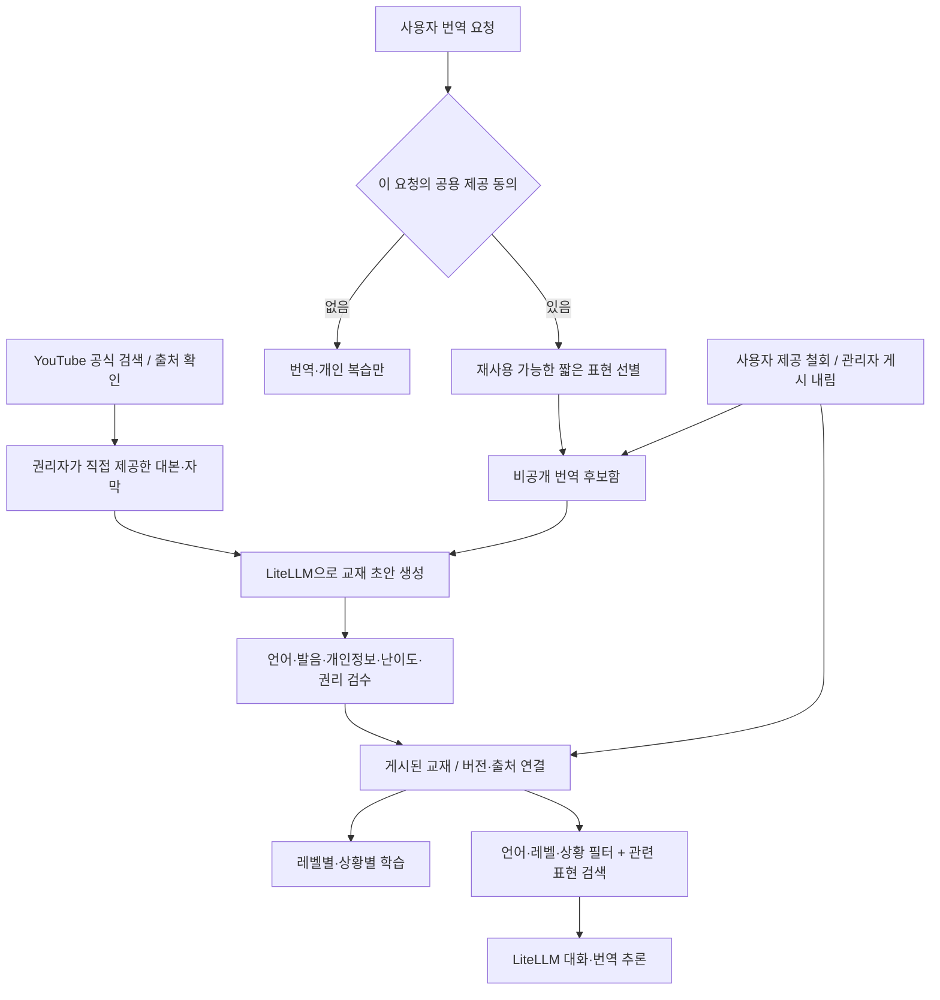

# 한마디 학습 지식·관리자 구축 계획

작성: 2026-09-29. 기준 소스: origin/main `2341b5e`. 단계: 구조·계획 → 화면 시안 → 기능 연결. 이 문서는 설계이며 운영 적용 또는 모델 학습 완료 기록이 아니다.

## 1. 학습의 의미와 선택

한마디 학습 데이터의 소유자는 Hanmadi 서버다. LiteLLM은 모델 호출·계정·비용·공급자 선택을 담당한다. 같은 모델 별칭으로 요청한다고 모델 가중치나 기억이 갱신되지 않는다.

1차는 **검수된 교재 + 검색한 예시를 추론에 제공하는 방식**으로 구축한다. 레벨별·상황별 수업은 게시한 표현을 읽고, AI 대화는 언어·레벨·상황에 맞는 게시 표현을 제한된 수만 참고한다. 번역은 같은 언어의 관련 예시를 찾되 원문의 의미·언어 방향을 우선한다. 개인 복습 기록과 공통 지식을 분리한다.

실제 파인튜닝은 별도 2차 실험이다. 학습 데이터셋, 모델 제공자의 학습 API, 비용·개인정보 처리·삭제 조건, 검증셋과 모델 버전이 필요하다. LiteLLM 공식 문서의 fine_tuning 경로는 조회 시 Enterprise 및 지원 공급자 조건을 명시한다. 현재 게이트웨이에 학습 작업을 전송하거나 구독 모델이 파인튜닝을 지원한다고 가정하지 않는다.

## 2. 현재 구현과 연결할 지점

| 현재 코드 | 확인한 상태 | 이번 연결 |
|---|---|---|
| `app/api/study/admin/route.ts` | 공식 YouTube 검색, 직접 제공한 원문으로 AI 초안, 검수 후 게시 | 관리자 자료함·번역 후보 검수·게시 이력 |
| `lib/v2-store.ts` | Redis CAS, 교재 200개 상한, 게시 표현을 앱에 전달 | 후보·교재·회수 관계를 하나의 원자적 상태로 관리 |
| `lib/v2-ai.ts` | 번역과 역할극, LiteLLM 공통 클라이언트 | 게시된 관련 예시를 프롬프트에 제공 |
| `app/api/study/route.ts` | 언어·레벨·상황·개인 복습 | 공용 제공 동의, 후보 저장 결과, 본인 자료 철회 |
| `components/v2-admin.tsx` | 단일 긴 입력 폼 | 독립 관리자 작업 화면 |

Hanmadi 2.0의 4언어(영어·일본어·태국어·스페인어), 앱 연습 레벨 1~4, 기존 8개 상황을 재사용한다. 앱 레벨을 CEFR/TOPIK 인증 등급으로 표시하지 않는다. 기존 Dify 튜터 경로와 공용 LiteLLM 서버 배포는 별도다.

## 3. 데이터 흐름



### YouTube 자료

- 공식 검색은 제목·채널·링크 확인에만 사용한다. 검색 결과를 서버에 영구 저장하거나 LLM 원문으로 전달하지 않는다.
- `captions.download`는 OAuth와 영상 편집 권한이 필요하다. 임의 공개 영상의 자막을 다운로드할 수 있다고 설계하지 않는다.
- 초기 실행 경로는 제작자가 직접 제공한 원문/SRT/VTT와 사용권 근거 등록이다. 영상 링크만 등록했다고 초안 생성을 성공 처리하지 않는다.
- 직접 운영하는 채널의 OAuth 자막 동기화는 권리·OAuth 소유·API 데이터 재사용 정책을 확인한 후 별도 구현한다. API에서 얻은 데이터와 권리자에게 직접 받은 원문은 취득 경로가 다르다.
- TODO(D1): 해당 채널의 실제 편집 권한, AI 처리·교재 재사용 허용 범위, YouTube API 데이터의 파생 콘텐츠 사용 조건. 확인 전 자동 자막 수집·벡터화·가중치 학습은 열지 않는다.

### 번역 후보

- 기본 OFF. 기존 개인 표현 자동 저장 동의는 공용 제공 동의로 해석하지 않는다. 이 번역 요청에 대한 명시적 동의만 인정한다.
- 번역 원문·원음·전체 대화는 학습 저장소에 보관하지 않는다. 번역에서 추출한 짧은 일반 표현, 한국어 뜻, 한글 발음 도움을 후보로 저장한다.
- 연락처·URL·숫자 패턴 필터는 완전한 익명화가 아니다. 관리자 검수가 필수이며 검수 전 사용자 앱·대화 검색에서 제외한다.
- 후보는 삭제 연결을 위한 서버 측 가명 actor를 보유한다. 관리자 응답은 actor를 노출하지 않는다. 이를 완전 익명 데이터로 광고하지 않는다.
- 사용자는 본인이 제공한 자료를 철회할 수 있다. 연결된 후보와 교재를 함께 제거하며, 철회 이전에 시작한 요청이 늦게 도착해도 자료를 복원하지 못하도록 제공 세대를 검사한다.
- 이미 생성되어 사용자에게 전달된 답변을 소급 삭제할 수는 없다. 철회 후 시작한 추론부터 자료가 제외된다. 공급자 로그 보존 정책은 별도 운영 확인 사항이다.

## 4. 저장·검수·버전 계약

기존 Redis `hanmadi:v2 / curriculum` 값을 읽을 때 옛 배열 형식을 호환한다. 갱신 시 버전 있는 객체(교재, 후보, 제공 세대, 감사 이력)로 CAS 저장한다. 운영은 기존 Redis를 재사용하고 파일 폴백은 개발 전용이다. 새 벡터 DB·이벤트 버스·공용 gateway DB 변경은 1차에 필요하지 않다.

- 교재: id, revision, 언어, 연습 레벨, 상황, 제목, 표현들, 권리 근거, 출처 URL, draft/published, 선택적 후보 id.
- 후보: id, 서버 가명 actor, 동의 버전·시각, 언어, 일반 표현, pending/converted/rejected, 생성 시각. 관리자에게 개인정보성 계정 정보는 전달하지 않는다.
- 이력: 게시/게시 내림/초안 저장/반려/회수의 시간과 대상 id, 버전. 원문·비밀값은 이력에 복사하지 않는다.
- 검수 체크는 내용·언어·레벨·상황·권리 근거가 바뀌면 초기화한다. 서버에서 역할과 검수 여부를 검사한다.
- 클라이언트 revision이 오래되면 409. 후보 철회와 게시가 경합하면 같은 CAS 단위에서 회수 상태를 재확인한다.
- 기존 draft/published 레코드는 유지한다. 게시 여부와 데이터 버전은 모델 학습 완료를 뜻하지 않는다.

## 5. 검색과 추론

1. 공용으로 게시된 교재만 읽는다. 교재를 내리거나 후보를 철회하면 다음 조회부터 제외한다.
2. 대화는 언어·상황·레벨을 먼저 정확히 제한한다. 해당 레벨이 없으면 다른 언어/상황의 자료를 억지로 넣지 않는다.
3. 번역은 언어와 입력에 대한 어휘 관련도를 사용한다. 관련도가 없는 자료는 넣지 않는다.
4. 시작은 제한된 규모(교재 200개)의 결정적 텍스트 검색으로 운영한다. 임베딩 학습 또는 벡터 RAG 완료라고 표시하지 않는다. 추후 다국어 검색 품질을 평가한 뒤 임베딩 어댑터를 추가한다.
5. 상위 소수 예시와 길이 상한을 적용한다. 가져온 내용은 신뢰할 수 없는 참고 데이터로 취급하고 모델 지시문으로 승격하지 않는다.
6. 관리자 미리보기는 실제 서버 검색 함수를 재사용한다. 선택한 언어·레벨·상황에서 어떤 게시 교재가 전달되는지 확인할 수 있다.
7. 모델·개인 연결 선택, 출력 스키마, 재시도 한도는 기존 정책을 유지한다. 검색 장애를 빈 검색 결과로 숨기지 않는다.

## 6. 학습 품질 평가와 향후 파인튜닝

먼저 사람이 작성·검수한 고정 평가셋을 만든다. 제안 규모는 4언어 × 4레벨 × 8상황 × 2문항(256개)이며 아직 평가 결과가 아니다. 원문/영상/사용자 단위로 분리하여 같은 자료가 개발·검증 양쪽에 섞이지 않게 한다.

평가 축: 목표 언어·한글 발음 형식, 뜻의 충실도, 상황 적합성, 난이도, 검색 근거 일치, 개인정보 포함 여부, 원문 지시문 주입 저항, 게시 내림·철회 반영. 단순 포맷 검사와 원어민/튜터 감수를 구분한다.

비교: 기본 프롬프트 → 검수 지식 검색 → 필요하면 파인튜닝+같은 검색. 검색을 붙인 뒤에도 반복되는 말투·난이도 오류가 있을 때만 파인튜닝을 검토한다. 운영자 승인된 데이터셋과 예산, 제공자 약관·지원 모델 확인, 고정 평가셋 개선, 롤백 가능한 모델 별칭이 착수 조건이다. 사용자 번역은 기본적으로 검색용 검수 자료이며 가중치 학습에는 별도 동의가 필요하다. 철회 가능한 데이터는 모델 가중치에 넣으면 삭제 문제가 달라진다.

## 7. 관리자 시안

제품 역할: 한마디 콘텐츠 편집자가 학습 자료를 검수하고 앱 반영 여부를 확인하는 별도 작업 공간. `/study/admin`을 유지해 기존 로그인·링크와 연결한다.

디자인 토큰:

| 역할 | 값 |
|---|---|
| 브랜드 파랑 | `#3157D5` |
| 본문 잉크 | `#182B49` |
| 배경 | `#F5F7FC` |
| 편집 종이 | `#FFFFFF` |
| 게시 상태 | `#166A55` |
| 검수 대기 | `#8A5210` |

폰트는 기존 앱과 같은 시스템 한글 글꼴(Pretendard가 설치되어 있으면 사용, Apple SD Gothic Neo·sans-serif 폴백). 큰 홍보 제목 대신 편집 중인 수업 제목이 중심이다. 흰 편집 공간과 파란 선택 표시, 읽기 좋은 3열 자료 목록/작업/미리보기 구조로 설계한다. 모바일은 탭과 단일 열로 접는다.

```text
한마디 콘텐츠 스튜디오                         학습 앱 열기
자료 만들기 | 번역 후보 | 앱 반영 확인
────────────────────────────────────────────────────────
교재 목록          수업 정보·출처               앱 적용 범위
  초안             원문 → AI 초안              언어 / 레벨 / 상황
  게시됨           표현·뜻·발음 검수           검수 / 게시 상태
  검색·필터        저장 / 검수 후 게시         게시 이력
```

시안 점검: 큰 지표 카드와 장식 차트는 제외한다. 콘텐츠 편집이 주요 업무이므로 문장과 검수 상태에 화면을 배정한다. 레벨·상황 필터, 출처, 검수 체크, 게시 내림을 한 흐름에서 확인하도록 한다. 실데이터가 없는 시안은 샘플이라고 표시한다.

## 8. 구현 순서와 인수 기준

1. **구조·계획(이 문서)**: 기존 저장소·추론 흐름과 권한 제약 확인.
2. **시안**: 실제 문장으로 자료함·번역 후보·적용 미리보기 탐색 가능한 HTML. 샘플/미연결 상태 표시. 데스크톱·모바일 확인.
3. **기능**: 기존 소유자 인증, 후보 제공·철회, 관리자 초안/검수/게시, 출처·버전·이력, 실제 검색 연결. 기존 운영 데이터는 자동 수집하지 않는다.
4. **검증**: 무동의 수집 차단, 학습자 관리자 접근 차단, 출처 철회 동시성, 미게시 검색 차단, 언어/레벨/상황 격리, 게시→앱 수업→AI 참고자료 전달→게시 내림 전체 경로.
5. **전달**: 본인 변경 커밋·작업 브랜치 push·PR. PR 머지와 운영 배포는 해당 PR 사용자 승인 후. 실공급자 비용·답변 품질과 OAuth 자막 수집은 코드/fixture 검사로 대체 인증하지 않는다.

## 공식 근거와 확인 범위

2026-09-29 문서 조회. 지원·요금·정책은 실행 시 다시 확인한다.

- [LiteLLM 개요](https://docs.litellm.ai/docs/): 통합 모델 호출·게이트웨이 역할.
- [LiteLLM fine_tuning](https://docs.litellm.ai/docs/fine_tuning): 제공자별 학습 작업 인터페이스와 라이선스 조건. 모델 자체를 LiteLLM이 학습한다는 뜻이 아니다.
- [YouTube captions.download](https://developers.google.com/youtube/v3/docs/captions/download): 영상 편집 권한 필요, OAuth scope, 호출당 200 quota units.
- [YouTube Developer Policies](https://developers.google.com/youtube/terms/developer-policies): API 데이터 저장·갱신·삭제 및 파생 데이터 조건. 직접 받은 대본의 사용권과 API 데이터 취득 권한을 동일시하지 않는다.

미확정: 사용자 채널·편집 권한, 실제 원문 권리, 운영 모델 학습 API/로그 정책, 번역 학습용 동의 최종 문구. 위 미확정을 성공한 연결이나 법률 검토 완료로 표시하지 않는다.
