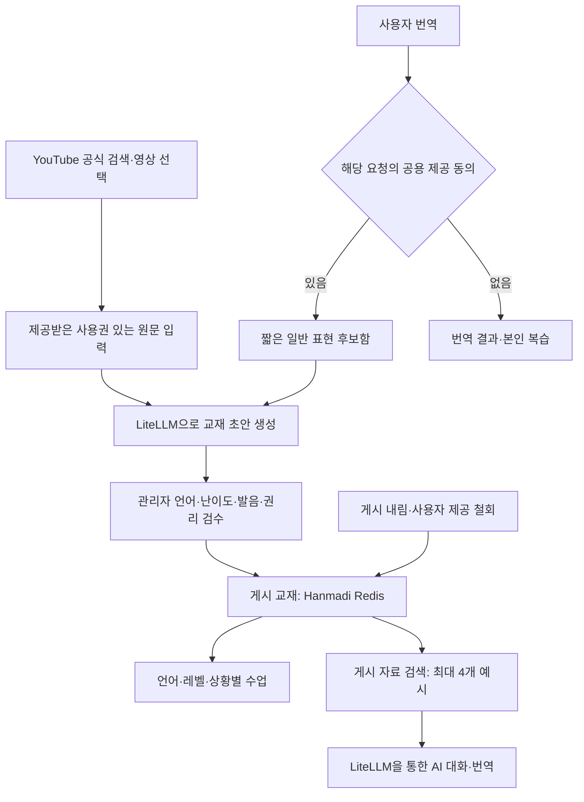

# Hanmadi · LiteLLM 학습 구조 점검

확인일: 2026-09-30. 배포 소스: main `159ed386167768d748942cfd469e34b888326a19`.

**검수한 자료를 저장하고 AI 추론에 제공하는 기본 구조는 운영에 구현돼 있다. 그러나 점검 시점의 추가 교재·게시 표현·번역 후보는 모두 0개다. 모델 가중치를 바꾸는 파인튜닝 작업 관리 기능은 구현돼 있지 않다.** 기존 기본 커리큘럼이 없다는 뜻은 아니다.

이번 점검은 코드·기존 계획·운영 API 확인이다. 운영 자료를 생성·게시하거나 모델 학습 작업을 실행하지 않았다. 사용자에게 학습 방식 선택을 요청했으며, 별도 선택 전에는 기존 1차 계획인 검수 자료 검색·활용을 기준으로 한다.

## 1. 현재 구현된 학습 구조

LiteLLM은 초안 생성과 답변 생성의 모델 호출을 담당하고, Hanmadi가 자료·검수·게시·회수를 담당한다. Hanmadi 2.0의 이 경로는 `studyCompletion()`에서 LiteLLM을 직접 호출한다. 예전 설계의 Dify 워크플로 경유와 구분한다.

| 단계 | 실제 구현 | 근거 파일 (배포 소스 기준) |
|---|---|---|
| 참고 영상 찾기 | 공식 검색, 5개씩 이동, 전체 선택, 준비 목록 | `components/youtube-video-search.tsx` |
| 원문 → 표현 초안 | 사용권 확인 후 LiteLLM 호출, 영상 제목·URL을 학습 원문으로 사용하지 않음 | `app/api/study/admin/route.ts` |
| 번역 → 공용 후보 | 요청별 동의, 짧은 일반 표현, 중복 방지, 개인정보 필터, 비공개 검수 | `app/api/study/route.ts`, `lib/knowledge-store.ts` |
| 저장·게시·회수 | Redis `hanmadi:v2`의 `curriculum`, CAS, revision, 출처 연결, 철회 세대 | `lib/knowledge-store.ts` |
| 레벨·상황별 학습 | 게시한 표현을 수업 단위로 변환 | `lib/v2-store.ts`의 `publishedUnits()` |
| AI 대화 참고 | 게시됨 + 같은 언어·정확한 레벨·상황, 최대 4개 | `lib/knowledge.ts`, `app/api/study/route.ts` |
| 번역 참고 | 같은 언어, 입력 어휘와 관련 있는 게시 예시, 최대 4개 | `lib/knowledge.ts`, `lib/v2-ai.ts` |
| 관리자 확인 | 앱과 동일한 검색 함수의 결과를 미리보기 | 관리자 API `action: preview` |

검색은 단어와 CJK/태국어 인접 글자 비교다. 벡터 검색이 아니며, 동일 레벨·상황의 대화 자료는 어휘 점수가 0이어도 보조 예시로 선택될 수 있다. 검색 품질이 검증된 의미 기반 검색으로 표현하지 않는다.

## 2. 운영 확인 결과

운영 주소: https://hanmadi-lake.vercel.app/study/admin

| 항목 | 점검 결과 |
|---|---:|
| 관리자 교재 (초안 + 게시) | 0개 |
| 게시된 추가 표현 | 0개 |
| 공용 번역 후보 | 0개 |
| 감사 이벤트 | 1개 |
| YouTube 검색 키 설정 | 있음 |
| 관리자 API | HTTP 200 |
| 자료 검색 미리보기 | HTTP 200, 0개 |
| 학습 API의 추가 게시 교재 | HTTP 200, 0개 |

계정·원문·키는 출력하거나 문서에 저장하지 않았다. 첫 미리보기 점검 요청은 Origin 헤더가 없어 정상적으로 403 거부됐다. 정상 운영 Origin을 포함한 요청은 200을 받았다. 앱 코드 변경이 필요한 오류는 아니었다.

지식 핵심 테스트 8개가 통과했다. 기존 검증 worktree에서 실행했으며 `knowledge.ts`, `knowledge-store.ts`, `knowledge.test.ts`가 현재 main과 동일한 것을 확인했다. 언어·레벨·상황 격리, 미게시 제외, 관련 없는 번역 제외, 제공자별 삭제, 철회 경합, revision 충돌, 모델 프롬프트 전달을 검사한다. 이는 고정 응답을 사용하는 구조 검사이며 실제 교육 품질이나 새 모델 학습 성공을 증명하지 않는다.

## 3. 아직 없는 부분

- **실제 추가 자료**: 현재 운영에 제공·검수·게시된 자료가 없다. 영상 선택만으로 자료가 생성되거나 모델이 학습되는 것은 아니다.
- **의미 기반 검색**: 임베딩 인덱스와 다국어 의미 검색은 미구현이다. 현재 규모 상한은 교재 200개, 후보 500개, 사용자별 후보 50개다.
- **고정 품질 평가**: 언어·레벨·상황별 검색·답변 품질 평가셋과 평가 실행·비교 화면은 없다. 기존 계획의 256문항은 제안 규모이며 작성·검수 완료된 데이터가 아니다.
- **불변 데이터셋·릴리스**: 교재의 현재 revision과 최근 500개 이벤트는 있으나, 과거 교재 내용 전체를 재현하는 불변 데이터셋 스냅샷·배포 승격·롤백 관리자는 없다.
- **파인튜닝**: 학습 파일 생성·업로드, 제공자 학습 작업 생성/조회/취소, 평가 결과, 학습 모델 등록·승격 기능이 없다. 저장소의 공개 게이트웨이는 추론 경로만 허용하며 학습 업로드·작업 경로를 노출하지 않는다. 이번 점검에서 서버 설정을 변경하지 않았다.

LiteLLM 공식 문서는 제공자 학습 API를 중계하는 fine-tuning 인터페이스를 제공한다. 별도 학습 파일과 대상 모델 설정이 필요하며, LiteLLM에 요청 기록을 쌓는 것만으로 모델이 학습되지는 않는다. 현재 Managed Fine-tuning 문서는 Enterprise 라이선스가 필요 없다고 명시한다. 과거 계획 문서의 라이선스 표현만으로 사용 가능 여부를 판단하지 않고, 실제 설치 버전·제공자·모델 지원을 실행 전에 확인해야 한다. [Fine-tuning API](https://docs.litellm.ai/docs/fine_tuning), [Managed Fine-tuning](https://docs.litellm.ai/docs/proxy/managed_finetuning)

## 4. 다음 구현·운영 순서

1. **검수 자료 활용 확인**: 한 언어·한 레벨·한 상황에서 자체 작성 또는 허가받은 원문 한 건을 등록한다. AI 초안 → 사람이 수정·검수 → 게시 → 수업 노출 → AI 참고자료 확인 → 게시 내림까지 확인한다. 현재 이미 구현된 기능을 사용한다.
2. **검색 품질 평가와 운영 현황**: 원문 출처별로 개발·검증 자료를 분리하고 고정 평가셋을 만든다. 검색 누락, 무관한 예시, 언어·상황·난이도 오류를 측정한다. 관리자에 게시 자료 수·언어/레벨/상황별 빈 구간·평가 결과를 표시한다.
3. **검색 고도화**: 평가에서 필요한 경우 LiteLLM 임베딩 어댑터와 검색 인덱스를 추가한다. 게시 상태·언어·레벨·상황 필터, 자료 버전, 철회 후 제외 조건을 유지하고 같은 평가셋으로 기존 검색과 비교한다.
4. **선택적 모델 추가 학습**: 검색만으로 해결되지 않는 말투·형식·난이도 문제를 대상으로 학습을 설계한다. 별도 사용 동의·권리가 확인된 데이터 → 출처 단위 train/validation/test 분리 → 불변 JSONL/manifest → 제공자 학습 작업 → 기존 모델과 고정 평가 → 운영자 승격 → LiteLLM 모델 별칭 연결 순서다. 제공자·모델·예산이 확정되기 전 실제 유료 학습 작업을 실행하지 않는다. 기존 공용 예시 제공 동의를 가중치 학습 동의로 확대하지 않는다.

기본 구조를 다시 만들기보다 운영 자료와 평가 체계를 채우는 것이 우선이다. 파인튜닝 선택 시 4단계를 별도 구현 범위로 구체화한다.

## 관련 기록

- [기존 학습 구조 계획](https://github.com/hhj4861/commerce-automation-kit/blob/159ed386167768d748942cfd469e34b888326a19/docs/HANMADI-KNOWLEDGE-PLAN.md)
- [구현 인수 기록](https://github.com/hhj4861/commerce-automation-kit/blob/159ed386167768d748942cfd469e34b888326a19/docs/HANMADI-KNOWLEDGE-IMPLEMENTATION.md)
- [지식 기능 운영 배포 기록](deployment/hanmadi-knowledge-20260929.md)
- [영상 검색 운영 배포 기록](deployment/hanmadi-video-search-20260930.md)

예전 문서의 '미구현/미배포' 문구는 당시 시점의 기록이다. 이번 운영 상태는 위 API 실조회와 배포 기록으로 구분했다.
