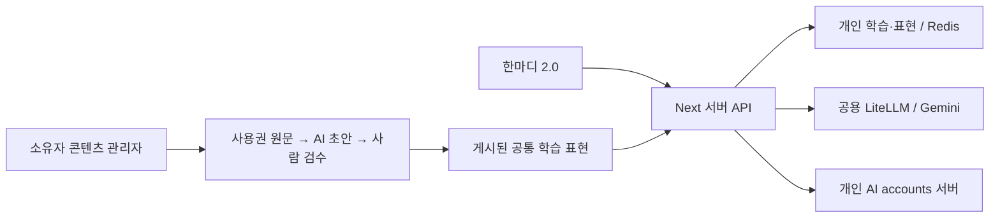

# 한마디 2.0 구현·인수 기록

승인된 2.0 디자인을 기존 Hanmadi 앱에 구현했다. 신규 진입점은 `/study`, 콘텐츠 관리자는 `/study/admin`이다. `/`는 `/study`로 이동한다. 기존 한국어·튜터 수업, Dify 회화는 `/learn`, `/conversation`, 학생 포털에 유지한다.

## 사용자 흐름

- 영어·일본어·태국어·스페인어 선택 → 언어별 듣기 문제 3개와 말하기 자기평가 → 4단계 연습 난이도 추천. 공인 등급이나 발음 평가가 아니다. 설정에서 난이도와 하루 5/10/15분을 변경할 수 있다.
- 스터디: 오늘 학습 / 레벨별 / 상황별. 기본 표현 128개(4언어 × 4레벨 × 8상황). 스몰토크·클럽/바·카페·식당·호텔·길 찾기·쇼핑·친구와 약속을 포함한다. 듣고 따라 말하기, 도움 받아/혼자 말하기 기록, AI 역할극으로 연결한다.
- 번역: 하나의 마이크로 30초 이내 발화를 녹음하거나 텍스트 입력. STT에 자동 모드를 전달할 때 강제 language를 보내지 않는다. 전사된 문자로 한국어/선택 언어 방향을 판정하고 짧거나 섞인 입력은 사용자 확인 후 처리한다. 상시 청취·동시 화자 분리·통역 중 끼어들기는 지원 범위가 아니다.
- 번역 자동 학습은 첫 동의 전 OFF. 켜면 성공한 번역의 짧은 일반 표현을 개인 복습에 반영한다. 양방향, 언어별 중복 제거, 삭제, 다음 복습일(도움 1일/혼자 3일)을 지원한다. 저장 자체는 학습 완료나 레벨 상승이 아니다.
- AI 대화: 실제 설정된 기본 LiteLLM 별칭(Gemini 운영 설정) 또는 연결된 개인 모델로 역할극. 한국어 도움과 한글 발음 제공. 마음에 드는 표현만 명시적으로 추가한다. 전체 대화 자동 수집은 하지 않는다.
- 내 AI: 기존 accounts 서버를 재사용한다. Codex 계정 로그인, Claude **API 키** 연결. Claude 구독 OAuth를 지원한다고 표시하지 않는다. 연결 해제/만료 시 기본 모델로 몰래 전환하지 않는다. 번역과 음성은 기본 서비스 유지.
- 학습자는 별도 아이디·비밀번호로 가입하며 튜터/관리자 권한을 받지 않는다. 기존 튜터 계정도 학습 화면을 사용할 수 있다. 비밀번호 복구/계정 탈퇴는 이번 버전에 포함하지 않았고 가입 화면에 복구 미지원 안내가 있다.

## 서버와 저장

학습자 쿠키는 튜터 쿠키와 별도이고 HMAC 서명·HttpOnly·SameSite=Lax·운영 Secure를 적용한다. 비밀번호는 scrypt 해시, 개인 AI subject는 기존 서버 비밀로 HMAC 처리한다. 서버가 계정으로 actor를 결정하며 클라이언트 actor/관리자 플래그를 신뢰하지 않는다. 변경 요청은 Origin 검증과 본문 크기 제한을 적용한다.

기존 Redis 드라이버에 compare-and-set을 추가했다. 개인 학습 상태와 콘텐츠 초안은 충돌 시 다시 읽어 갱신한다. 삭제와 자동 반영 변경은 저장 세대를 올려 먼저 시작된 AI 응답이 늦게 표현을 되살리지 못하게 한다. 개인 표현 500개, 기록 2,000개, 관리자 초안 200개 상한과 기존 AI 일별 예산을 적용한다. 운영에서 파일 저장 폴백은 거부한다.

원음·번역 원문·전체 AI 대화·입력한 콘텐츠 원문은 한마디 학습 저장소에 저장하지 않는다. 번역 학습 추출은 개인정보 제외 지시와 연락처/URL 등 결정적 필터를 사용하지만 완전한 개인정보 탐지기는 아니다. 공급자/게이트웨이의 요청 로그 정책은 별도 운영 설정이며 이 변경으로 변경하지 않았다. 개인 표현은 UI에서 개별 삭제할 수 있다.

## 관리자 원문과 YouTube

공식 `search.list`로 영상의 제목·채널·링크를 찾아 화면에 표시한다. 검색 메타데이터를 LLM 학습 자료로 보내지 않으며 서버에 검색 결과를 저장하지 않는다. 영상/자막 다운로드나 스크래핑은 구현하지 않았다.

실제 초안 생성 입력은 관리자가 직접 제공한 사용권 있는 텍스트/SRT/VTT다. AI 처리·학습 재사용 권한 근거와 확인이 필수이며, AI 초안은 비공개로 저장한다. 언어·발음·개인정보·권리 검수 후 게시하면 해당 언어/레벨/상황에 나타난다. 게시 내리기와 수정 충돌 방지도 지원한다. 이는 LLM 가중치 학습이 아니라 **공통 학습 콘텐츠 추가와 개인 복습 기록 축적**이다.

공식 근거:
- [YouTube search.list](https://developers.google.com/youtube/v3/docs/search/list): 공식 영상 검색. 관련 언어는 검색 힌트로 사용하며 엄격한 언어 필터로 취급하지 않는다.
- [YouTube captions.download](https://developers.google.com/youtube/v3/docs/captions/download): OAuth와 영상 편집 권한이 필요하므로 임의 공개 영상 자막 수집 경로로 쓰지 않는다.
- [LiteLLM audio transcription](https://docs.litellm.ai/docs/audio_transcription): 파일 기반 전사 API. 실제 지원 언어·품질은 운영 STT 모델 검증이 필요하다.

## 배포 설정

기존 환경을 재사용하며 비밀 값은 Git에 없다.

| 용도 | 서버 변수 |
|---|---|
| 로그인 서명 | `AUTH_SECRET` (기존 튜터 키 파생 설정도 호환) |
| 영구 저장 | `UPSTASH_REDIS_REST_URL/TOKEN` 또는 `KV_REST_API_URL/TOKEN` |
| 기본 대화·번역·초안 | `LITELLM_BASE_URL`, `LITELLM_API_KEY`, `LITELLM_MODEL` |
| 음성 | `LITELLM_STT_MODEL`, `LITELLM_TTS_MODEL`, `LITELLM_TTS_VOICE` |
| 개인 AI | `AI_ACCOUNTS_URL`, `AI_ACCOUNTS_KEY`, `AI_ACCOUNTS_SUBJECT_SECRET` |
| 공식 영상 검색 | `YOUTUBE_API_KEY` (미설정이면 원문 직접 입력은 계속 가능) |
| 콘텐츠 소유자 | 기존 `TUTOR_PINS` 소유자 로그인 |

공용 Dify/gateway 배포는 이 앱 변경에 포함하지 않는다. PR별 명시적 머지 승인 후 `docs/deployment/platform-gitops.md`의 Hanmadi 배포 절차로 운영 반영한다. 현재 작업 브랜치 구현과 운영 배포를 구분한다.

## 검증

- `npm ci --workspaces=false`, `npm test`: 기존 기능과 새 학습 규칙 42개 통과.
- `npm run build`: Next.js 16.3.6 운영 빌드·타입 검사 통과.
- `npm run lint`: 오류 없음. 변경 전 파일의 unused 변수 경고 4개 유지.
- `npm audit --workspaces=false`: 확인된 취약점을 호환 패치로 수정, 0건. Next.js [16.3.6 보안 릴리스](https://github.com/vercel/next.js/releases/tag/v16.3.6) 적용, 앱과 모노레포 잠금 파일 동기화.
- `npm run test:v2`: 브라우저 → 실제 Next API → 격리된 테스트 저장소 → 응답 UI. `HANMADI_LOCAL_DATA_FILE`은 개발 모드에서만 사용하며 E2E 전용 파일을 종료 시 제거한다. 외부 모델·accounts는 격리된 테스트 서버로 대체한다. 실제 사용자 구독 로그인·실서비스 발음 품질·운영 Redis 인수 시험을 했다는 뜻이 아니다.
- PR마다 `.github/workflows/hanmadi-v2.yml`에서 같은 테스트를 실행하며 화면 증거를 보관한다.

화면 증거: [모바일](hanmadi-v2-e2e/mobile.png), [데스크톱](hanmadi-v2-e2e/desktop.png), [번역](hanmadi-v2-e2e/translation.png), [관리자](hanmadi-v2-e2e/admin.png). 개발 모드 스크린샷이며 운영 화면으로 오인하지 않는다.

기본 외국어 예문과 한글 발음은 승인 목업을 초기 콘텐츠로 옮긴 것이다. 외부 원어민 감수는 수행하지 않았다. 태국어 여성 화자용 정중 표현의 차이는 연습 화면에 안내한다.
