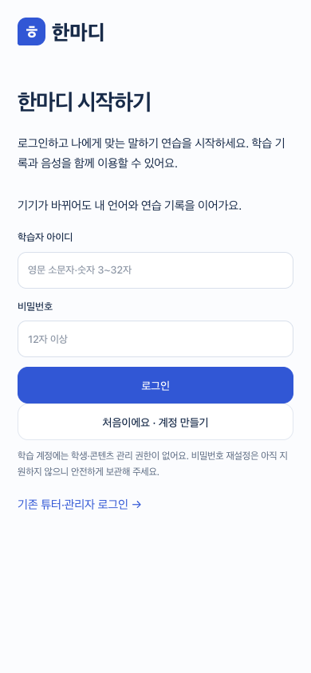
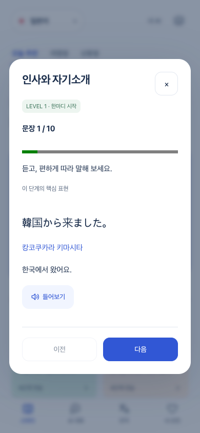
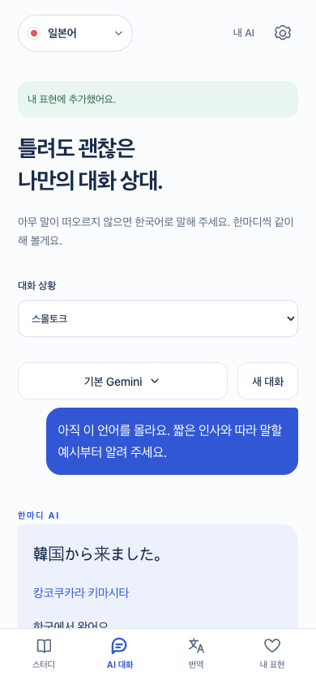
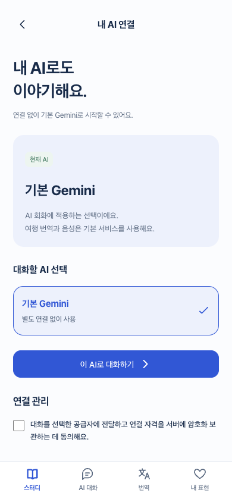

# Hanmadi: ten-phrase lessons and login-first UX

Implementation branch: `fix/hanmadi-ten-phrase-lessons`. This document describes local verification, not a production deployment.

## User-visible behavior

- `/study` checks the account before exposing language selection, study, translation, conversation or audio. Guests see the login/sign-up form first. Returning sessions keep their selected language and profile; logging out returns to this same entry screen.
- Every starter lesson now offers ten distinct phrases, original text, Korean meaning, approximate Hangul pronunciation and the existing audio control. Previous/Next replace the hidden-answer and self-confidence steps. Only the last phrase exposes Finish. Closing midway does not save completion.
- The first phrase remains the selected level's existing core expression. Nine additional phrases support the same situation. These supporting phrases are shared across levels; this change does not claim ten unique advanced expressions per level. Duplicates are removed, with common conversation-repair phrases used as a fallback. All 128 starter units (four languages × eight scenes × four levels) have ten phrases.
- Completion adds `profiles[language].completedLessons` without assigning a speaking-confidence score or changing legacy practice records. Completed lessons become review candidates after one day; unseen lessons retain priority. Existing self-report review for individually saved expressions is unchanged.
- My AI now starts with usable model choices and the conversation action. Connection management appears below, with readable provider names, error recovery guidance, loading state and retry. Polling no longer clears a failed connection action's error. Claude remains the official API-key flow; this does not implement subscription OAuth.
- Conversation controls use a full-width scene selector, then aligned model and New conversation buttons.

## Verification (2026-09-29)

- `npm test`: 44 passed, including ten distinct phrases for every starter unit and completion without self-rated proficiency.
- `npm run test:v2`: passed. Login-first signup, previous/next, completion storage, early close, invalid/cross-language lesson IDs, learner isolation, speech API authentication, translation/chat, provider routing, Claude setup consent/cancel, admin publishing and responsive layouts.
- New conversation control alignment/overflow checks at 320, 360, 390, 768 and 1440 px.
- Direct Chrome inspection: reproduced the old production toolbar misalignment; inspected the local 390 px lesson, phrase transition, revised chat controls, AI settings, and logout-to-login entry. Production account preferences and credentials were not changed.
- `npm run build`: passed, including TypeScript and 47 routes.
- `npm run lint`: zero errors; four pre-existing unused-variable warnings in unrelated files.
- Automated upstreams are fixtures. This verification does not claim live Codex/Claude authentication or human-audited audio/pronunciation accuracy.

## Screens

