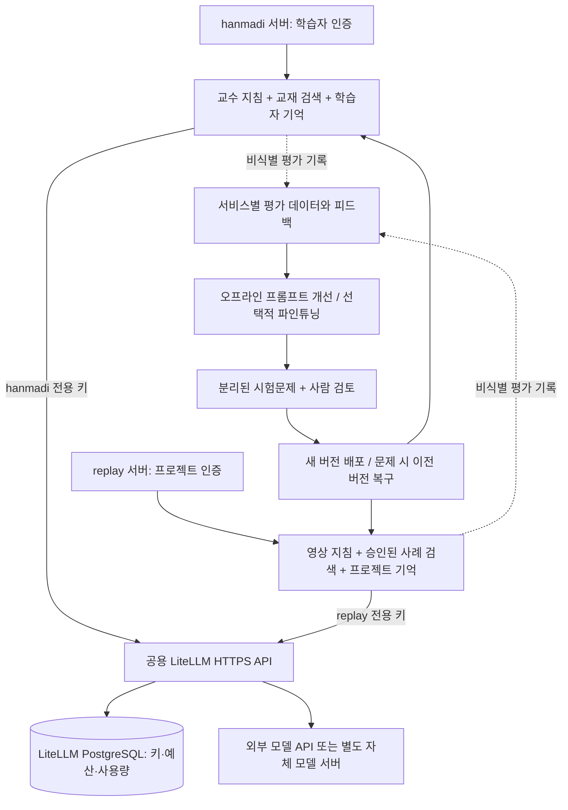

# 공용 LiteLLM과 서비스별 AI 개선 구조

조사일: 2026-09-26. 범위: 독립 서버 구성 준비 + 공개 솔루션 조사 + Dify 포크/배포 설정/앱 템플릿. 클라우드 생성·운영 배포·기존 PR 병합은 포함하지 않는다.

## Dify 채택 후 구현

사용자 선택에 따라 [Dify 포크](https://github.com/socar-hyunz/dify)를 만들고,
1.17.1 고정 소스에 별도 배포 overlay를 적용하는 구성을 추가했다.
[실행 안내와 앱 템플릿](../services/dify/README.md): 한 내부 워크스페이스에 hanmadi 회화 chatflow와 replay 영상 기획 workflow를 둔다.
두 모델은 기존 LiteLLM의 서로 다른 가상 키/모델 별칭을 사용한다. 원본 Dify 코드는 변경하지 않는다.
아래 개선 루프는 여전히 후속 설계이며, Dify 도입 자체가 자동 학습을 구현한 것은 아니다.
Dify는 실행/대화 기록을 저장하므로 기존 앱의 비저장 정책을 그대로 충족한다고 가정할 수 없다.
실사용자 연동 전에 보존·삭제 정책과 서버 인증 어댑터가 필요하다.

## 결론

하나의 **논리적 LiteLLM 게이트웨이**를 hanmadi·replay·추가 플랫폼이 함께 사용할 수 있다. 서비스마다 모델·키·예산을 분리한다. 서비스별로 다른 기반 모델이나 파인튜닝 모델을 선택해도 같은 API 주소를 유지할 수 있다. 물리적으로 영원히 한 프로세스/한 머신이어야 한다는 뜻은 아니다.

LiteLLM 자체가 대화를 읽으며 가중치를 계속 갱신하는 학습 모델은 아니다. 인증·모델 라우팅·비용 제한을 맡는다. 모델 호출 로그를 저장하거나 모델 별칭을 다르게 붙이는 것만으로 서비스 전문성이 학습되지는 않는다. 일부 학습·메모리 API를 중계할 수 있어도 실제 저장/학습/평가는 해당 백엔드의 역할이다. [공식 소개](https://docs.litellm.ai/docs/), [가상 키](https://docs.litellm.ai/docs/proxy/virtual_keys).

권장 출발점은 **LiteLLM + PostgreSQL + 서비스별 지식/기억 저장소 + Langfuse 평가**다. 데이터가 쌓인 뒤 DSPy/GEPA로 프롬프트 후보를 개선하고, 그것으로 부족한 반복 문제에만 파인튜닝을 검토한다. 이는 조사에 기반한 이 프로젝트의 설계 제안이며 아직 품질 향상이 실측된 구조는 아니다.

## 요청과 개선의 흐름

지식 검색·기억 결합은 모델 호출 **전** 애플리케이션이 수행한다. 공용 AI 애플리케이션 API로 나중에 추출할 수 있지만, 이번에는 앱별 역할을 한 거대한 게이트웨이 플러그인에 넣지 않는다. 모델 별칭은 라우팅 이름이며 그 자체가 튜터 또는 영상 전문가를 구현하지 않는다.

## '학습한다'는 말의 네 가지 의미

| 방법 | 달라지는 것 | hanmadi 예 | replay 예 | 모델 가중치 |
|---|---|---|---|---|
| 지식 검색(RAG) | 답변 시 참조하는 자료 | 검수한 교재·문법·교정 사례 | 승인된 대본·브랜드 가이드·제작 사양 | 그대로 |
| 장기 기억 | 사용자/프로젝트별 상태 | 수준, 자주 틀리는 표현, 학습 목표 | 브랜드 톤, 선호 컷 길이, 이전 수정사항 | 그대로 |
| 프롬프트 최적화 | 지침·예시·처리 순서 | 더 짧고 정확한 수준별 교정 | 형식 오류가 적은 장면 계획 | 그대로 |
| 파인튜닝/LoRA | 선택한 모델의 파라미터/어댑터 | 반복되는 교수 행동·출력 스타일 | 반복되는 구조화된 대본·분석 형식 | 변경 |

기억은 개인화, RAG는 외부 지식 제공이다. 둘 다 모델의 일반 지능이 자동 상승했다는 뜻은 아니다. 평가 점수가 개선되어야 '이 업무에서 좋아졌다'고 말할 수 있다. [Letta 기억 구조](https://docs.letta.com/v1-sdk/concepts/stateful-agents), [DSPy 최적화 종류](https://dspy.ai/3.2.0/learn/optimization/optimizers/).

파인튜닝은 데이터 준비 → 지원하는 기반 모델 선택 → 학습 작업 실행 → 별도 평가 → 모델 버전 배포 과정이다. 모든 모델/음성/영상 공급자가 이를 지원하는 것은 아니다. LiteLLM의 `/fine_tuning` 중계 기능은 현재 공식 문서에 **Enterprise 기능**으로 표기돼 있다. 초기 OSS 구성은 공급자의 공식 학습 API나 자체 학습 도구로 학습을 수행하고, 생성된 모델의 추론 엔드포인트를 게이트웨이에 등록하는 방식으로 설계한다. 실제 공급자·모델 지원은 선정 시 다시 확인한다. [LiteLLM fine-tuning](https://docs.litellm.ai/docs/fine_tuning).

replay에서 대본·샷 계획 LLM을 개선하는 것과 실제 영상을 생성하는 확산/영상 모델을 학습하는 것은 다르다. 이 설계의 첫 범위는 **기획·대본·영상 분석용 모델 호출**이다. 외부 영상 생성기 자체가 사용 기록으로 개선되는 것은 아니다. 별도 영상 모델 학습에는 권리 있는 영상 데이터·지원 모델·학습 연산이 필요하다.

## 기존 프로젝트 조사

다음은 공식 문서/저장소에서 기능 또는 연동을 확인한 결과다. 제품 전체를 로컬에서 설치·성능 비교한 결과는 아니다. hanmadi와 replay에 맞춘 자동 학습까지 완성된 단일 패키지는 이번 조사에서 확인하지 못했다.

| 프로젝트/조합 | 이미 제공하는 기능 | 이번 프로젝트에서의 판단 |
|---|---|---|
| **LiteLLM + Langfuse** | 공식 게이트웨이 연동, 호출 추적, 프롬프트 관리, 점수·평가 데이터·실험 비교 | 가장 직접적인 기반. 학습 도구 자체가 아니라 개선 결과를 측정하는 도구 |
| **Dify + OpenAI 호환 공급자** | 앱/워크플로·지식 검색·모델 연결을 관리하는 플랫폼, API 제공 | 지식 기반 앱을 빠르게 만들 때 유용. 기존 앱에 추가 운영 계층이 생기며 커스텀 라이선스 조건 확인 필요 |
| **Letta** | 대화 사이에 유지되는 기억을 가진 상태 유지 에이전트 | 학습자/프로젝트를 기억하는 역할에 적합. 기억 편집이 가중치 학습은 아님. 현재 버전의 LiteLLM 경유 호환성은 별도 PoC 필요 |
| **DSPy / GEPA** | 평가 지표와 텍스트 피드백으로 지침·프로그램 후보를 최적화 | '피드백을 받아 개선'하는 오프라인 단계에 적합. 데이터·채점 기준·호출 예산을 우리가 제공해야 함 |

근거:

- [LiteLLM ↔ Langfuse 공식 연동](https://langfuse.com/integrations/gateways/litellm), [Langfuse 데이터셋](https://langfuse.com/docs/evaluation/experiments/datasets), [자체 호스팅](https://langfuse.com/self-hosting).
- [Dify 저장소](https://github.com/langgenius/dify), [공식 OpenAI 호환 공급자 플러그인](https://marketplace.dify.ai/plugin/langgenius/openai_api_compatible). OpenAI 호환 API를 이용한 LiteLLM 연결은 이 두 인터페이스에 근거한 설계이며 이 프로젝트에서 E2E 검증하지 않았다.
- [Letta 문서](https://docs.letta.com/), [기억 구조](https://docs.letta.com/v1-sdk/concepts/stateful-agents).
- [GEPA 알고리즘·피드백 계약](https://dspy.ai/3.1.1/api/optimizers/GEPA/overview/), [DSPy 최적화](https://dspy.ai/3.2.0/learn/optimization/optimizers/).

Dify는 일반 Apache 2.0과 동일하게 가정하면 안 된다. 저장소 라이선스는 workspace 기준 다중 tenant 운영과 프런트엔드 로고 변경 등에 별도 조건을 둔다. 한 서버를 여러 제품에 제공하는 형태가 해당 조건에 들어가는지는 실제 운영 방식으로 확인해야 한다. [원문 라이선스](https://github.com/langgenius/dify/blob/main/LICENSE).

LiteLLM OSS의 팀·가상 키·예산으로 시작한다. 팀별 외부 로그 라우팅·일부 고급 관리 기능은 Enterprise 목록에 있으므로 무료 기능으로 가정하지 않는다. Langfuse는 각 앱 서버에서 별도 프로젝트 키로 기록하는 방식을 먼저 검토한다. 태그만 다르게 넣는 것은 접근 권한 격리가 아니다. [LiteLLM 기능 구분](https://docs.litellm.ai/docs/enterprise).

## 서비스 격리와 데이터 정책 — 제안

| 경계 | hanmadi | replay |
|---|---|---|
| 게이트웨이 팀 | `cak-hanmadi` | `cak-replay` |
| 모델 별칭 | `hanmadi-chat`, `hanmadi-stt`, `hanmadi-tts` | `replay-video-planner` |
| 지식 저장소 | 검수된 교재·교정 사례 | 권리가 있는 승인 대본·브랜드 가이드 |
| 개인 기억 | 인증된 학습자 ID 기준 | 인증된 고객/프로젝트 ID 기준 |
| 평가 프로젝트 | 언어·수준별 교수 품질 | 대본·장면·제작 제약 준수 |
| 향후 모델 버전 | 예: `hanmadi-tutor-v2` | 예: `replay-planner-v3` |

하나의 Postgres 서비스를 쓰더라도 게이트웨이 DB와 앱의 기억/지식 DB는 별도 DB·계정으로 분리한다. 학생과 다른 학생, replay 고객과 다른 고객을 섞지 않는다. 서버가 인증 결과에서 tenant/user를 정하며 클라이언트가 보낸 이름만으로 검색 범위를 선택하지 않는다. 모델 별칭·메타데이터 태그만으로 저장소 격리를 대신하지 않는다. 검색·캐시·평가 데이터셋에도 동일한 권한 경계가 필요하다.

현재 앱의 대화·음성 비저장 정책은 이번 서버 구성으로 변경하지 않는다. 개인화 기억과 학습 데이터 수집은 별도 구현 시 저장 항목·보존 기간·삭제·학습 사용 동의를 정한 뒤 켠다. 원음 전체를 기본 학습 데이터로 보관하지 않는다. 개인 기록을 공용 파인튜닝 데이터에 자동 편입하지 않는다.

## 실제 개선 루프 — 후속 구현

1. 초기 버전의 프롬프트·모델·검색 설정을 고정하고 평가 문제를 마련한다.
2. 사용자가 고친 답변, 튜터 교정, 제작자의 승인/반려 이유를 서비스별로 수집한다. thumbs-up만으로 정답이라고 보지 않는다.
3. 개인정보·사용권·중복·잘못된 교정을 검토한 사례만 개선용 데이터로 승격한다. 모델이 스스로 만든 답을 그대로 정답으로 재학습하지 않는다.
4. 학습/개발 데이터와 최종 시험 데이터를 나눈다. 같은 학습자·프로젝트의 유사 사례가 양쪽에 섞여 점수가 부풀지 않도록 한다.
5. 지식·예시·프롬프트 후보부터 개선한다. 필요 시 GEPA를 고정 예산으로 실행한다. 모델의 자기평가 점수만 쓰지 않고 형식 검사와 사람 판단을 함께 사용한다.
6. 언어/난이도/업무별 회귀 검사와 비용·지연을 비교하고 검토된 버전만 제한 배포한다. 이전 버전으로 되돌릴 수 있게 한다. 무조건 사용량이 늘수록 좋아진다고 보장하지 않는다.

hanmadi 평가는 문법/의미 정확성, 한국어 설명 정확성, 학습자 수준 적합성, 교정의 일관성을 언어별로 확인한다. 음성 인식/합성 품질은 대화 모델과 별도로 평가한다. replay는 JSON/타임라인 형식, 샷 길이·제작 제약, 승인 가이드 준수, 수정 소요를 본다. 조회수 상승은 소재·유통 등 여러 요인의 영향을 받으므로 대본 모델 품질의 단독 정답 지표로 삼지 않는다.

## 이번에 준비한 것과 남은 것

구현: [독립 서버 디렉터리](../services/ai-gateway/README.md)에 LiteLLM/Postgres Compose, 선택적 공개 HTTPS, 고정 이미지 digest, 비밀 초기화, 모델 설정 렌더, 팀/키 발급, 권한/재시작 CI 검사. 기존 hanmadi 내부의 로컬 PoC와 독립적이며 서비스 서버용 가상 키를 사용한다.

검증: 로컬 단위 검사 7개 통과. [GitHub Actions 실행](https://github.com/hhj4861/commerce-automation-kit/actions/runs/36246648997)에서 실제 LiteLLM/PostgreSQL 컨테이너 기동, 서비스별 모델 조회/호출 허용, 다른 서비스 모델/관리 API 거부, 잘못된 키 거부, 키 중복 발급 방지, 재시작 후 키 유지, Caddy 설정 검증을 통과했다. 모델 공급자는 테스트 전용 모의 서버다. 실제 공급자 품질·청구 예산 초과 차단·공개 인증서 발급·백업 복구를 검증한 것은 아니다.

미구현: 클라우드 배포, 실제 모델 공급자 선택, replay 호출 어댑터, RAG, 개인 기억, 피드백 UI/수집, Langfuse 배포/연동, DSPy 학습 작업, 파인튜닝. 이 문서의 개선 루프는 설계다.

다음 순서: 독립 서버 CI → 호스팅/도메인/모델 선택 → 공개 서버 배포·앱 연결 → 서비스별 평가와 지식 저장 → 검증된 개선 루프. 새 학습 서비스를 한 번에 모두 설치하지 않는다. LiteLLM만 중계하면 GPU는 필요하지 않고, 자체 모델 서빙/학습을 택하면 그 연산 자원을 별도로 계산한다.
