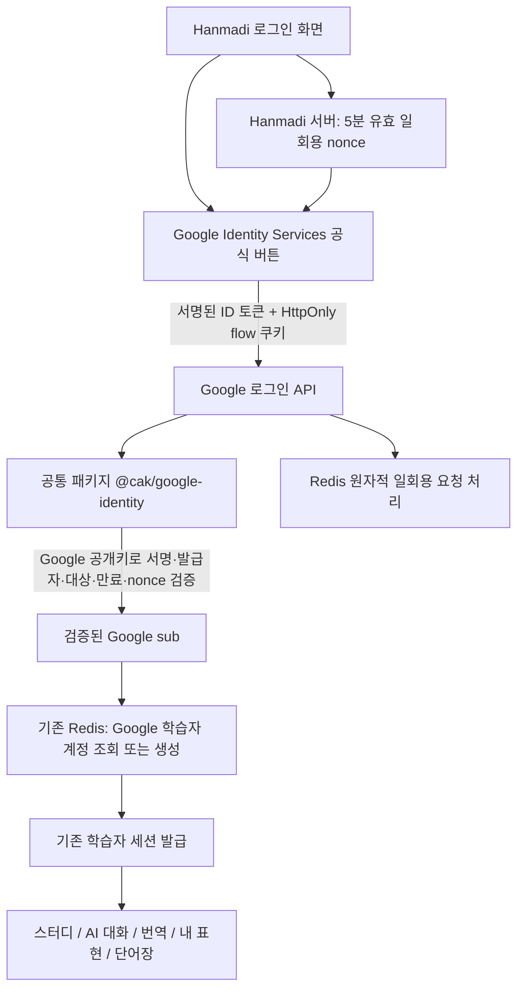

# Hanmadi Google 학습자 로그인

## 확인 결과와 범위

기존에는 여러 앱이 공유하는 로그인 패키지가 없었다. Hanmadi는 `lib/learner-auth.ts`의 아이디·비밀번호 학습자 세션과 `lib/auth.ts`의 튜터·관리자 PIN 세션을 분리해서 사용한다. Shopshorts의 Google 로그인은 해당 앱 안에 별도로 구현되어 있다. `@cak/litellm-client`는 AI 요청용이며 사용자 인증 모듈이 아니다.

이번 변경은 누구나 Google 계정으로 **학습자**로 가입할 수 있도록 한다. 기존 학습자 세션·스터디·AI 대화·번역·내 표현·단어장 저장 경로를 그대로 사용한다. 관리자 배포에서는 Google 학습자 인증 경로가 닫혀 있다. Shopshorts 로그인 구현은 이번 변경 대상이 아니다.

## 공통 모듈과 앱의 경계

- `packages/google-identity`: Google ID 토큰 검증만 담당한다. 계정 생성·앱 권한·쿠키·스토리지를 알지 못한다. 다른 앱도 같은 검증 기능을 사용할 수 있으나 앱 간 SSO나 계정 통합을 자동으로 제공하지는 않는다.
- `apps/hanmadi/lib/google-learner-auth.ts`: CSRF/nonce, 요청 제한, 계정 생성·조회 및 기존 학습자 세션 연결을 담당한다.
- `apps/hanmadi/components/google-login.tsx`: 공식 Google 버튼, 진행·실패 안내, 기존 아이디 로그인 접근을 담당한다. 설정이 없으면 Google 버튼을 노출하지 않는다.
- Hanmadi 독립 빌드에서는 `vendor/cak-google-identity-0.1.0.tgz`를 설치한다. CI가 소스와 배포 패키지의 구현·타입 일치를 확인한다.

## 데이터와 권한

Google의 변하지 않는 `sub`를 SHA-256한 `google-learner:<hash>` 필드에 내부 UUID·표시 이름·이메일·가입 시간을 저장한다. 기존 `hanmadi:v2` Redis 저장소를 사용한다. 이메일과 이름은 계정 연결 키가 아니다. 같은 이메일이어도 다른 `sub`는 다른 학습자다. 이메일이 바뀌어도 같은 `sub`는 같은 학습 기록을 사용한다.

Google 토큰·Google 비밀번호·access/refresh token은 저장하지 않는다. 검증된 ID 토큰은 해당 로그인 요청에서만 사용한다. 사용자에게 발급하는 것은 기존 30일 HttpOnly 학습자 쿠키다. Google 로그인도 이전 튜터·언어 쿠키를 지우며 `studyIdentity().owner`는 항상 false다.

기존 아이디 계정과 Google 계정은 자동 통합하지 않는다. 기존 학습 기록을 연결하는 UI는 이번 범위에 없다. 향후 연결 기능은 두 계정의 본인 확인을 모두 마친 후 별도로 구현해야 한다.

## 운영 설정

1. Google Cloud의 Google Auth Platform에서 **웹 애플리케이션** OAuth 클라이언트를 준비한다. 일반 사용자 가입 목적에 맞게 대상/게시 상태를 설정한다.
2. 승인된 JavaScript 원본에 실제 Hanmadi 앱 도메인을 등록한다. 현재 앱 도메인은 `https://hanmadi-lake.vercel.app`이며 로컬 검증용 원본은 실제 사용하는 localhost 포트까지 일치해야 한다. 관리자 도메인은 등록 대상이 아니다. 이 구현은 GIS 팝업 콜백 방식이므로 별도 OAuth redirect callback 경로를 사용하지 않는다.
3. Hanmadi **학습 앱**에 `HANMADI_GOOGLE_CLIENT_ID=<웹 클라이언트 ID>`를 설정한다. 클라이언트 ID는 공개 식별자이며 클라이언트 비밀키는 필요하지 않다.
4. 서버에는 명시적인 `AUTH_SECRET`(32자 이상)과 기존 운영 Redis 설정이 필요하다. 정상 운영 중인 서명 키를 임의 교체하면 기존 세션이 무효화되므로 기존 값을 확인·유지한다.
5. 승인된 앱 배포 후 실제 Google 계정으로 최초 가입 → 학습 저장 → 로그아웃 → 재로그인 → 관리자 접근 거절을 확인한다. 설정 누락 시 기존 아이디 로그인만 제공한다.

서버는 same-origin JSON POST, 본문 크기 제한, IP별/전체 요청 제한, 서명된 5분 flow 쿠키, Google JWT의 RS256 서명·발급자·aud/azp·만료·검증 이메일·nonce를 검사한다. Redis `SET NX EX`로 nonce 재사용과 동시 재전송을 차단한다. 생성 계정은 CAS로 중복 가입 경쟁을 처리한다. 저장소·Google 검증 실패는 로그인 실패로 표시하며 관리자 권한으로 대체하지 않는다.

## 검증

- 공통 검증 패키지: 자체 생성 키로 실제 JWT 서명·검증 및 위조/만료/대상/nonce/이메일 검증 실패 테스트.
- Hanmadi 단위 테스트: 동시 가입·재전송, 계정 격리, CSRF, 쿠키 위변조·만료, 설정 누락·관리자 차단, 요청 한도.
- `npm run test:google-login`: 테스트 프로세스에서만 Google 공개키 응답과 외부 GIS UI를 대체한다. 실제 앱 HTTP 경로·서명 검증·학습자 쿠키·저장소·화면 로그인·실패 안내·재로그인·개인 단어장 격리·기존 비밀번호 로그인을 확인한다. 서비스 코드에는 테스트 토큰 허용 경로나 공개키 URL 변경 옵션이 없다.
- **실제 Google 동의 화면·운영 OAuth 원본 설정 검증은 별도**다. 자동화 테스트 통과를 운영 Google 로그인 완료로 보고하지 않는다.

공식 근거: [ID 토큰 검증 및 sub 사용](https://developers.google.com/identity/gsi/web/guides/verify-google-id-token), [공식 로그인 버튼](https://developers.google.com/identity/gsi/web/guides/display-button), [GIS JavaScript nonce 설정](https://developers.google.com/identity/gsi/web/reference/js-reference).

### 2026-10-05 구현 검증 결과

- Hanmadi 단위 테스트 229개, 공통 Google 토큰 검증 17개 통과.
- Chrome 모바일 화면 통합 테스트 통과: 잘못된 nonce의 실패 안내, 임시 쿠키 제거, 학습자 로그인, 관리자 접근 거절, 단어 저장·로그아웃·재로그인 복원, 같은 이메일의 다른 계정 격리, 기존 비밀번호 로그인. 외부 Google GIS 버튼과 JWKS만 테스트용 대체이며 실제 Google 동의 화면 검증은 아니다.
- 별도 관리자 배포 E2E 통과: 새 Google 경로 GET/POST 모두 404, 기존 관리자 사용자 흐름 유지.
- 운영용 Next 빌드·타입 검사 통과, lint 오류 0개(기존 경고 4개), GitOps 계약 테스트 26개 통과.
- 로컬 테스트 산출물: `/Users/admin/Library/Mobile Documents/com~apple~CloudDocs/gpt 작업/hanmadi/google-login-20261005/`.
- 운영 Google OAuth 클라이언트 설정·실제 계정 검증·운영 배포는 미수행.

### 운영 공개 전 개인정보 안내 보완

- 로그인 전 `/privacy`에서 개인정보 처리방침을 읽을 수 있으며, Google 로그인 영역·학습 설정·일반 페이지 하단에 연결한다.
- 현재 실제 구현에 맞춰 Google 계정 처리 항목, 쿠키, 학습 기록, AI 입력 전송, 별도 공용 자료 제공 동의, 보관·삭제 한계와 운영자 문의처를 안내한다.
- Google Auth Platform에는 운영 홈페이지와 `https://hanmadi-lake.vercel.app/privacy`를 등록한다. 페이지 공개와 OAuth 설정 완료 여부는 운영 확인 후 별도 기록한다.
- 근거: https://developers.google.com/terms/api-services-user-data-policy 의 공개 개인정보처리방침 요구. 이 안내는 법률 적합성 전반의 인증을 의미하지 않는다.
