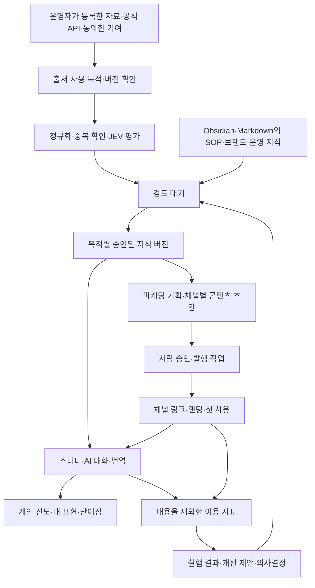

# 플랫폼 공통 지식·마케팅·운영 구조

작성: 2026-10-01. 상태: **설계안 — 런타임 미적용**. 사용자 선택: **Hanmadi부터 적용하고 다른 서비스로 확장**.

목표는 검증한 지식을 보관하고, 서비스 제공과 마케팅에 목적별로 재사용하며, 결과를 다음 개선에 연결하는 것이다. 이 문서 저장은 DB 생성·이관, SNS 발행, 광고 집행, 새 모델 도입이나 파인튜닝 실행을 의미하지 않는다. 진행 중인 Hanmadi Admin 영상 JSON 수정 배포와도 별도 범위다.

## 1. 결정과 범위

- **플랫폼**은 Hanmadi 같은 독립 서비스이고 **채널**은 YouTube·Instagram·검색·이메일 같은 유입 경로다. 서비스마다 독립된 지식·고객·운영·브랜드를 가지며, 채널별 출력 규격과 배포 연결을 추가한다.
- 공통화할 것은 출처·버전·권한·승인·AI 작업·측정 계약이다. 회화 수업과 상품 판매 같은 도메인 규칙을 하나의 범용 테이블/프롬프트로 합치지 않는다.
- 처음에는 Hanmadi 앱/어드민과 단일 백엔드의 모듈로 구현한다. 별도 그래프 DB·마이크로서비스·이벤트 버스는 도입하지 않는다. 관계는 ID와 연결 테이블, 비동기는 DB 작업 큐/outbox로 시작한다.
- 영구 원장은 PostgreSQL, 파일은 비공개 객체 저장소, 반복 요청·잠금은 기존 Redis, 검색은 PostgreSQL의 텍스트 검색과 필요 시 pgvector를 권장한다. 호스팅 업체·지역·백업 비용은 기존 인프라를 확인한 뒤 선택한다. 새 클라우드 리소스는 아직 생성하지 않는다.
- Obsidian/Markdown은 운영자 지식·SOP·의사결정을 편집하는 창구로 사용한다. 여러 사용자의 실시간 기록·결제·권한·승인 원장은 서버 DB가 책임진다.
- 특정 Gemma 버전이나 모델에 저장 구조를 종속시키지 않는다. 모델 교체는 LiteLLM 경로와 작업별 어댑터에서 처리하고, 실제 지원 여부는 해당 런타임에서 검증한다.

## 2. 현재 코드에서 확인한 출발점

코드 조사 기준: 영상 수정 `b90532b`와 main의 단어장 PR #106. 코드 존재와 운영 활성화는 구분한다.

| 영역 | 현재 구현 | 확장할 부분 |
|---|---|---|
| 개인 학습 | `v2Driver()`의 Redis `hanmadi:v2` 아래 `study:{actor}`에 프로필·진도·표현을 JSON 저장, CAS로 경쟁 수정 방지 | 사용자/언어/기능별 레코드·변경 이력·페이지 조회 |
| 내 표현 | 번역/대화의 연습 가능한 표현을 사용자 설정에 따라 저장, 중복 해시·회수 epoch 존재, 최대 500개 | 문맥·출처 참조·목적별 동의, 복습 이력 별도 보관 |
| AI 대화·번역 | 대화 전체를 자동 영구 저장하지 않음. 번역의 `shareForLearning=true`일 때 공용 후보 수집 | 개인 보관·공용 기여·모델 학습·마케팅 목적을 서로 분리 |
| 단어장 | PR #106의 선택 단어/짧은 표현을 문맥으로 풀이하는 코드 확인 | 단어의 뜻별 항목과 개인 저장/복습 상태 분리, 최신 담당 변경과 이관 계약 합의 |
| 공용 자료 | 하나의 `curriculum` JSON에 초안·기여·이벤트·학습 상태 저장. 초안 200개, 기여 500개/개인 50개 한도 | 자료/버전/승인/평가/작업을 분리, 파일 및 관계 원장 |
| 지식 검색 | 게시 자료의 어휘 검색 + 선택적 의미 검색 코드가 이미 존재 | 영구 벡터 저장, 목적·권한 필터, 언어별 회귀 평가; 단순히 새 RAG를 중복 구축하지 않음 |
| 자료·모델 버전 | dataset snapshot/digest/분할, 검색 평가, 학습 작업·검수·활성화 코드 존재 | 독립 레코드, 중단/회수 전파, 긴 작업 복구 |
| 영상 분석 | Redis에 24시간 배치/분석/결과 캐시, JEV 후 초안/검토 대기 | 캐시와 영구 출처/평가 원장 분리; 운영 성공은 별도 QA 참조 |

근거 파일: `apps/hanmadi/lib/{store,v2-store,knowledge-store,knowledge,learning-types,learning-pipeline,learning-retrieval,learning-training,video-ingestion}.ts`, `app/api/study/route.ts`. Redis를 곧 유실되는 저장소라고 단정하지 않는다. 현재 코드도 영구 저장을 요구한다. 이전 이유는 규모 증가 시 관계·변경 이력·목적별 접근을 관리하기 위해서다.

## 3. 전체 흐름

개인 저장에서 공용 지식으로 자동 연결되는 선은 없다. 명시적으로 기여한 안전한 후보만 다시 수집 단계로 들어간다. 모델이 생성한 결과도 출처가 있는 후보이며, 사람이 검수한 사실로 자동 승격되지 않는다.

## 4. 공통 데이터 계약

DB 이름은 설계 예시이며 아직 생성하지 않았다. 공통 외부 계약은 `@cak/contracts`에 append-only로 추가하고 원자끼리 직접 import하지 않는다. 앱이 원자를 조합한다.

| 묶음 | 주요 객체 | 책임 |
|---|---|---|
| 범위·접근 | `workspaces`, `platforms`, `memberships`, `purpose_grants` | 서버가 결정하는 서비스·사용자·역할·사용 목적 |
| 출처·지식 | `sources`, `knowledge_items`, `knowledge_revisions`, `knowledge_links` | 원본 식별자/해시, 버전, derived_from/translation_of/supports/supersedes 관계 |
| 승인·품질 | `evaluations`, `reviews`, `consents`, `audit_events` | JEV/규칙 평가, 사람 결정, 동의·철회 이력 |
| 검색·학습 | `retrieval_chunks`, `dataset_versions`, `dataset_members`, `training_jobs` | 재생성 가능한 색인, 고정 데이터셋 명세, 공급자 학습 작업 |
| 미디어·작업 | `assets`, `jobs`, `job_attempts`, `outbox` | 파일 참조·해시·접근 범위, 재시도·비용·실패·중복 방지 |
| 마케팅 | `audiences`, `campaigns`, `creative_versions`, `publications`, `experiments` | 고객 가설, 승인된 표현/자산, 채널별 발행, 성과 비교 |
| 제품 운영 | 플랫폼별 도메인 테이블, `support_cases`, `decisions`, `playbooks` | 서비스 기능 상태, 고객 지원, 운영 판단, 버전 있는 절차 |

지식의 기본 봉투에는 `id`, `workspace_id`, `platform_id`, `scope`, `owner_subject_id?`, `kind`, `revision`, `source_id`, `content_hash`, `language`, `tags`, `status`, `created_at`, `updated_at`를 둔다. `scope`는 개인/플랫폼/명시적으로 공유 승인한 범위로 구분한다. 외부 입력이 `workspace_id`나 소유자를 선택하게 하지 않는다.

사용 권한은 단순 `public=true` 대신 **목적과 버전**에 연결한다: `personal_use`, `product_retrieval`, `public_marketing`, `model_training`. 공개 영상이라는 사실이나 JEV의 높은 점수는 마케팅 재사용·모델 학습 허용의 증거가 아니다. 원문과 파생 자료의 출처·승인 범위를 추적한다.

새 버전은 이전 내용을 덮어쓰지 않는다. `source_changed`/철회 시 해당 파생 자료·색인·데이터셋을 무효화한다. 개인정보 삭제가 필요한 본문은 버전 정책을 이유로 영구 보관하지 않고 삭제/비식별 처리하며, 최소한의 처리 증적만 남긴다.

### Hanmadi 도메인

| 기능 | 보관할 내용 | 다른 기능과 연결 |
|---|---|---|
| 스터디 | `lesson_versions`, `lesson_units`, `user_progress`, `practice_events` | 수업은 고정된 지식 버전 참조, 개인 숙련도는 별도 |
| AI 대화 | 선택 저장한 `conversation_sessions/turns`, 교정·요약, 참조 자료 ID | 기본은 현행 보관 선택 유지, 선택 표현만 내 표현으로 이동 |
| 번역 | 선택 저장한 입력/결과/언어, 모델·프롬프트 버전, 참조 ID | 개인 기록과 공용 후보의 동의를 분리, 원문 전체를 공용화하지 않음 |
| 내 표현 | 개인 소유 표현, 원문맥/출처, 태그, 수정·복습 상태 | 공유된 표현 원본 참조 + 개인 메모/오버라이드 |
| 단어장 | lemma/표기·언어·품사·뜻/용례별 항목, 개인 `user_vocabulary`, 복습 로그 | 같은 철자도 문맥과 뜻이 다르면 구분; 문장 해시만으로 합치지 않음 |
| 어드민 | 자료 수집·버전·JEV·검수·게시/회수·검색 평가·학습 작업 | 사용자 원문을 일상 운영 목록에서 노출하지 않음 |

표현과 단어는 연결되지만 하나로 합치지 않는다. 예를 들어 “おすすめは何ですか”라는 표현과 그 안의 “おすすめ” 어휘는 독립 복습 항목이고, 생성된 문맥 풀이에는 source/model/revision을 남긴다. 서비스별 기존 ID는 이관 매핑표로 보존한다.

## 5. 저장과 검색

| 저장소 | 보관 대상 | 운영 원칙 |
|---|---|---|
| PostgreSQL | 사용자 상태·지식 메타/내용·승인·평가·마케팅/작업 원장 | 트랜잭션·외래키·서비스/소유자 조건, 필요한 테이블에 RLS |
| 비공개 객체 저장소 | 허용된 원본 첨부·자체 제작 이미지/음성·수업/학습 산출물 | DB에는 참조만, 짧은 만료 서명 URL, 접근/삭제 이력 |
| 기존 Redis | 검색 결과·세션·속도 제한·분산 잠금·재생성 가능한 캐시 | 캐시 장애가 원본 유실로 이어지지 않게 구성 |
| PostgreSQL + pgvector | 자료 버전별 검색 조각·벡터·모델/차원/해시 | 원본이 아닌 파생 색인, 모델 변경 시 재색인 |
| Git/Markdown + 선택적 Obsidian | 브랜드·용어·SOP·판단 근거·승인된 비민감 지식 내보내기 | 개인 대화·PIN·토큰·고객 원문은 넣지 않음 |

조회는 인증 → 서비스/소유자/목적/게시 상태 필터 → 텍스트·의미 검색 → 관련도·최신성 평가 → 선택된 소량 자료 → 응답 직전 권한/회수 재확인 순서다. 권한을 나중에 프롬프트로 필터링하거나 다른 사용자 자료를 모델에 먼저 넘기지 않는다.

한국어·일본어 검색은 기본 공백 분리만으로 충분하다고 가정하지 않는다. 현재 CJK 보완 검색과 의미 검색을 기준으로 고정 질의셋을 만들고, 정확한 단어/부정어/상황/레벨/동음이의어별 재현율과 잘못된 검색을 평가한다. 새 인덱스는 기존 방식보다 낫다는 평가 후 활성화한다.

캐시 키는 서비스, 접근 범위, 목적, 언어/상황/레벨, 질의 해시, 자료 버전, 프롬프트/모델 설정 버전을 포함한다. 비공개 질의는 공용 캐시에 섞지 않는다. 동의 철회·게시 취소 시 관련 캐시와 색인을 무효화하며 오래된 캐시로 검색 제한을 우회하지 않는다.

## 6. JEV·LLM·학습 역할

- LLM은 분석·정리·번역·초안 생성, JEV는 정해진 선택지로 평가, 애플리케이션은 권한·형식·예산·상태 전이를 결정한다. JEV는 사실 검증이나 사용권 확인의 대체물이 아니다.
- 평가는 `candidate_revision`, 비교 자료/검색 snapshot, `rubric_version`, JEV 모델/설정 버전, 분류/점수/불확실성, 근거 참조, 비용·시간을 저장한다. 같은 입력/기준이면 재사용하고 비교 지식이 바뀌면 새 평가를 만든다.
- 수업 자료: 유용성·정확성 근거·레벨·중복. 마케팅: 브랜드 일치·근거 없는 주장·채널 적합성. 운영 답변: 정책 버전·권한·근거. 기준과 임계값을 업무별로 분리한다.
- 기존 JEV 담당과 조율한 후속 후보는 예시 관련성(H1), 요청 의도(H2), 번역 검사(H4), 저장 적합성(H5), 교정 분류(A4)다. 의미 판단에는 JEV를 우선 검토한다. 모든 요청에 무조건 동기 호출을 붙이지 않고 생성 전 분기·캐시 재사용·사후 평가를 업무별로 선택하며, 정답 라벨셋으로 오판·지연·비용을 비교한 뒤 기능별로 활성화한다. 담당의 현재 계획 전달을 새 유료 호출·키 발급 승인으로 해석하지 않는다.
- 현재 영상 평가의 낮은 신뢰도는 사용자가 선택한 **검토 대기**로 유지한다. 기존 기준을 마케팅에도 그대로 복사하지 않는다. 평가 실패/불확실/예산 초과는 별도 상태로 표시한다.
- `검색용 지식 게시 → RAG로 사용`과 `모델 가중치 학습`은 별도 경로다. LiteLLM에 자료를 저장하거나 호출했다고 학습됐다고 표시하지 않는다.
- 파인튜닝은 목적 권한을 확인한 고정 dataset + 출처 단위 train/validation/test 분리 → 비용 확인 → 명시 실행 → 독립 평가 → 승인한 모델 별칭 활성화 순서를 유지한다.
- 학습 후 자료를 철회해도 모델 가중치에서 자동 삭제되지는 않는다. 해당 데이터셋·모델을 영향 대상으로 표시하고 활성 별칭 해제/재학습 여부를 검토한다. 원문 삭제를 모델의 망각으로 보고하지 않는다.

긴 작업은 `queued → running → succeeded / partial / failed / cancelled / unknown` 상태와 작업별 시도 기록을 갖는다. lease·heartbeat·취소·시간 제한·동시성·예산을 서비스/제공자별로 제어한다. 제출 결과가 불명확하면 공급자 작업 ID를 먼저 대조하고 유료 작업을 자동 재제출하지 않는다. 현재 영상 선택 10개/동시 처리 3개 제한은 별도 성능 근거 없이 확대하지 않는다.

## 7. 마케팅에서 서비스 이용까지

Hanmadi의 첫 실험 예시는 “일본 여행 중 카페에서 주문하고 싶은 초보자”다. 성과가 검증된 고객군이라는 뜻은 아니며 시작 가설이다.

1. 고객 가설·해결할 문제·검증할 행동을 캠페인에 기록한다.
2. **마케팅 목적도 승인된** 카페 회화 지식 버전과 자체 자산을 선택한다.
3. 같은 근거로 YouTube Shorts 대본·Instagram 카드·검색용 랜딩 초안을 만들되, 채널별로 훅/길이/CTA를 따로 검수한다.
4. 사람 승인 후 공식 연결을 통해 게시하거나 수동 게시용으로 내보낸다. 결과는 외부 게시 ID/실제 URL/버전으로 저장한다.
5. 링크로 카페 상황 학습에 진입 → 첫 연습 완료 → 표현 저장 → 재방문을 측정한다.
6. 실험 기간·노출/클릭/완료의 분모를 함께 보고, 개선 제안을 검토해 다음 캠페인/SOP 버전을 만든다.

| 대상 채널 | 저장할 고유 정보 | 초기 운영 |
|---|---|---|
| YouTube/Shorts | 게시 ID, 제목/설명 버전, 랜딩 링크, 제공되는 공식 지표 | 기존 `youtube-upload`/`shorts-publish` 계약 재사용 가능성 확인 |
| Instagram | 계정 연결, 콘텐츠 유형/미디어, 캡션/CTA, 외부 게시 ID | 공식 API/기존 연결 가능 범위 확인 후 연결, 미지원은 수동 |
| 검색·웹 | 랜딩/문서 버전, 검색 의도, 서비스 기능 진입 경로 | Hanmadi 웹의 상황별 진입점을 먼저 구현 |
| 이메일·메시지 | 수신 동의·구독 상태·템플릿 버전·발송 결과 | 동의/수신거부가 준비된 뒤 도입; 자동 DM 기본값 없음 |
| 유료 광고 | 계정·승인 소재·예산·집행 승인·외부 상태 | 초기 범위 제외, 기존 `meta-paid-reach`의 PAUSED/사람 게이트 존중 |

공식 API의 게시 권한·지표·할당량은 연결 시점에 문서/실계정으로 확인한다(`TODO(D1)`). 미지원 항목을 스크래핑으로 보완하지 않는다. 지표가 없는 경우 0으로 채우지 말고 unavailable로 남긴다.

이벤트 공통 봉투: `event_id`, `event_name`, `occurred_at`, `schema_version`, `workspace_id`, `platform_id`, 선택적 가명 session/subject, `campaign_id`, `creative_revision_id`, `content_revision_id`, 허용 목록 properties. 번역 원문·대화·이메일·토큰은 분석 이벤트에 넣지 않는다.

첫 측정: `landing_view → learning_started → first_practice_completed → expression_saved → return_practice`. 첫 연습 완료가 활성화 기준이며 정의를 버전으로 고정한다. UTM은 유입 표시이고 인과관계나 정확한 기기 간 고객 식별을 보장하지 않는다. 알 수 없는 경로는 unknown으로 유지하고 캠페인별 전환 수와 관측 기간/분모를 같이 제시한다.

## 8. 어드민 구성과 운영 권한

상단 서비스 선택기에는 처음에 Hanmadi만 표시한다. 존재하지 않는 기능을 사용 가능한 것처럼 보여주지 않는다.

| 메뉴 | 핵심 화면 |
|---|---|
| 현황 | 유입→첫 사용→재방문, 자료 품질, 대기/실패 작업, 비용 |
| 지식·자료 | 출처, 중복 후보, 자료 버전/비교, 목적별 승인, 게시·회수 |
| 학습 운영 | 언어·상황·레벨·교재, 검색 품질, 검토 대기, 데이터셋/학습 작업 |
| 마케팅 | 고객 가설, 캠페인, 채널별 소재, 승인함, 발행 일정/결과, 실험 |
| 고객 지원 | 요청한 사용자 지원 건, 최소한의 접근, 처리 이력 |
| 운영 기준 | 브랜드·용어·SOP·의사결정·사용 목적 정책·버전 |
| 연결·작업 | 제공자/채널 상태, 작업 큐·재시도·예산, 비밀값 대신 연결 상태 |

학습 검수자는 자료를 검수하고, 마케팅 편집자는 마케팅 허용 자료만 사용하며, 게시자는 승인된 소재를 발행한다. 서비스 관리자 권한만으로 사용자 대화 열람 권한을 자동 부여하지 않는다. 지원 접근은 목적·시간·대상을 제한하고 기록한다. AI에게는 해당 역할의 API와 작업 범위만 부여한다.

Obsidian 입력은 `id + base_revision + kind + source + intended_purposes` 메타데이터를 포함한 Markdown을 **검토 후보**로 가져온다. 충돌 시 비교 화면에서 해결하며 last-write-wins로 운영 자료를 덮어쓰지 않는다. 초기에는 승인된 비민감 지식의 단방향 내보내기를 먼저 구현하고 양방향 편집은 이후 단계로 둔다. Markdown 안의 지시문을 실행 규칙으로 자동 채택하지 않는다. SOP는 별도 승인 버전을 사용한다.

## 9. 보관·삭제·복구

보관 기간은 제품 설정으로 정하고 화면에 알린다. 아래는 초기 제안이며 기존 사용자 기록에 즉시 소급 적용하지 않는다.

- 개인 저장 표현·단어/진도: 사용자가 유지하는 동안 보관. 대화/번역 전체 기록은 선택 저장과 별도 보관 기간을 둔다. 음성 원본은 기본 비보관을 유지하고 필요한 처리가 끝나면 제거한다.
- 캐시: 현재 YouTube 검색 1시간, 영상 처리 캐시 24시간을 출발점으로 유지. 영구 출처/검수 기록은 캐시와 독립적으로 저장한다.
- 사용자 삭제/동의 철회: 요청 원장 → 즉시 조회 차단 → 파생 색인/캐시/공유 자료/데이터셋 무효화 → 파일·공급자 사본 처리 추적. 재시도와 삭제 전파 완료 여부를 표시한다.
- 감사 기록: 행위·대상 ID·결과 중심으로 보관하고 원문/비밀을 포함하지 않는다. 원문의 삭제와 최소 감사 증적의 보관을 구분한다.
- 백업: 암호화·권한 분리·복원 시험을 마련한다. 복원 시 삭제 tombstone/철회 원장을 재적용해 지워진 자료가 살아나지 않게 한다. RPO/RTO는 업체 선택/복원 실측 후 약속하며 현재 수치 보장을 하지 않는다.

## 10. Hanmadi부터 적용하는 순서와 완료 기준

| 단계 | 구현 범위 | 완료 기준 |
|---|---|---|
| 0. 이관 계약 | 현행 Redis 필드/크기/동의·철회/개인 표현/PR #106 단어장 조사, DB·객체 저장소 선정, ID 매핑 | 기존 동작·권한·복원 경로 명세, 비용/지역/백업 검토. 원문을 로그로 출력하지 않음 |
| 1. 영구 자료 원장 | 공통 범위/출처/버전/평가/승인 계약, Hanmadi 저장 어댑터, 읽기 비교 | 건수·해시·관계·개인 격리 일치, 동시 수정/철회/삭제 검증, 기존 API 호환 |
| 2. 개인 학습 연결 | 진도·표현·단어/복습, 현재 보관 설정 보존, 공용 후보 경계 | 타 사용자/서비스 자료 접근 차단, 반복 저장·다중 탭·삭제 중 처리 검증 |
| 3. 검색·AI 운영 | 현재 RAG 이전, 색인·JEV 이력, 작업 큐/비용, 어드민 자료/작업 화면 | 고정 검색셋·출처 추적, 낮은 신뢰도 검토 대기, 비용 상한, 실패 복구 |
| 4. 마케팅 1개 흐름 | Hanmadi 고객 가설 1개, 채널 1개, 랜딩 1개, 소재 승인, 활성화 측정 | 승인한 실제 게시/링크와 첫 연습 완료까지 추적. 실제 게시 전에 소재/대상 승인 |
| 5. 운영 지식/확장 | 비민감 Markdown 내보내기, SOP·의사결정, 두 번째 서비스 어댑터 | 서비스 간 격리 시험, 재사용한 계약과 개별 규칙 구분 |

이관은 무제어 dual-write 대신 변경 원장/outbox와 체크포인트를 사용한다. 기존 저장소가 권위 원장인 동안 snapshot+이후 변경을 새 DB에 적용하고 읽기 비교한다. 최종 변경을 따라잡고 기능별 쓰기 주체를 한쪽으로 전환한다. 전환 뒤 새 쓰기가 발생했다면 예전 snapshot으로 단순 되돌리지 않고 역반영/동기화 후 복구한다. 기존 학습/어드민 배포 브랜치는 분리 유지한다.

첫 구현 PR 범위는 **단계 0~1 중 공통 계약·자료 원장 어댑터·이관 검증**으로 좁힌다. 전체 사용자 데이터 이관이나 마케팅 실행을 한 PR에서 하지 않는다. 다음 PR에서 개인 기록과 검색을 순차 이전한다. 각 PR은 기존 사용자 승인·GitOps 절차를 따른다.

## 11. 참고 자료와 확인 한계

- [Obsidian 공식: Vault는 로컬 폴더](https://github.com/obsidianmd/obsidian-help/blob/master/Sandbox/Vault%20is%20just%20a%20local%20folder.md): Markdown 기반 운영 지식 편집 제안의 근거.
- [PostgreSQL 공식: Row Security Policies](https://www.postgresql.org/docs/current/ddl-rowsecurity.html): 사용자/서비스 행 접근 제한. 서비스 앱의 권한 검증을 대체하지 않고, 소유자/우회 권한을 가진 런타임 계정을 쓰지 않도록 설계한다.
- [pgvector 공식](https://github.com/pgvector/pgvector): PostgreSQL 내 벡터 검색 선택지. 운영 설치·성능 검증은 아직 하지 않았다.
- [LiteLLM 공식](https://docs.litellm.ai/docs/): 모델 연결 계층과 앱의 지식 원장을 구분하는 근거.
- 사용자 참고 영상 [마케팅 관련 링크](https://youtu.be/w4nNR3olvow), [Obsidian 관련 링크](https://youtu.be/fc7Nt94kGrw): 이번 확인에서 첫 링크 본문은 확보하지 못했고 두 번째는 공개 제목만 확인했다. 전체 자막/시연·성과를 검증하지 않았으며, 위 설계는 사용자가 제공한 대화의 아이디어와 실제 코드에 대한 **자체 적용안**이다. 영상이 이 서버 구조를 사용한다고 주장하지 않는다.

문서 검증 범위: 코드·공식 문서와의 대조, Markdown 링크/상대 경로 및 diff 확인. 본 설계의 DB·큐·마케팅·Obsidian 연결은 아직 구현/운영 검증하지 않았다.
