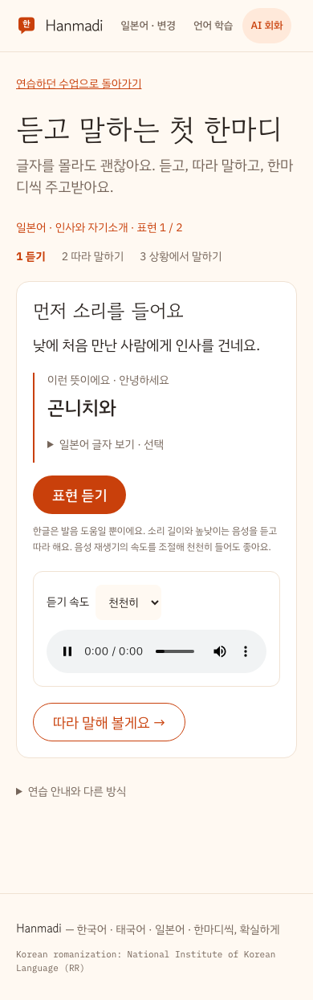
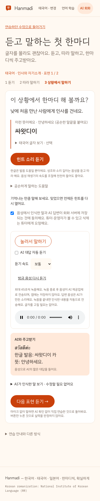

# Hanmadi — 글자를 몰라도 시작하는 일본어·태국어 회화

구현 브랜치: `feat/hanmadi-first-conversation`. 운영 사이트와 운영 Dify 앱에는 아직 적용하지 않았다. 이 문서는 구현과 함께 관리하는 설계·검증 기록이다.

## 사용자의 첫 목표

일본어·태국어를 읽거나 쓰지 못해도 듣고 한마디를 말할 수 있어야 한다. 자유 입력창과 문자 문제를 첫 관문으로 두면 이미 배운 사람이 유리하다.

일본국제교류기금의 [Irodori 소개](https://www.jpf.go.jp/e/project/japanese/teach/tsushin/news/202105.html)는 생활 상황에서 할 수 있는 행동을 목표로 두고, 듣기 입력 다음에 내용 이해·따라 말하기·역할극을 연결한다. [Starter 학습 방법](https://www.irodori.jpf.go.jp/assets/data/starter/pdf/X_howto_en.pdf)도 상황과 목표를 확인하고 듣고 연습하는 구조를 설명한다. 이 원리를 한마디의 기존 자체 표현에 적용했다. 교재의 음성이나 지면을 복제하지 않았으며, 태국어 학습 효과가 별도로 검증됐다는 뜻은 아니다.

## 실제 학습 흐름

1. 언어 선택 후 **처음이에요 · 듣고 말하기부터**를 누른다. 문자 문제 없이 시간 목표만 정하고 입문으로 시작한다. 배운 적이 있는 사람은 기존 선택 진단을 사용할 수 있다.
2. 인사·카페·길 묻기에서 한 번에 표현 하나를 한국어 상황으로 소개한다. 먼저 원어 소리를 듣고, 필요하면 한글 발음 도움을 본다. 원문 글자는 접어 두고 선택적으로 연다.
3. **눌러서 말하기 → 말 다 했어요**로 녹음한다. 인식 문장을 편집하거나 전송 버튼을 따로 누를 필요 없다. 전사는 접힌 보조 정보이며 인식 오류가 학습자의 잘못이라고 판단하지 않는다.
4. 같은 표현을 상황에서 한 번 더 말한다. 발음 힌트는 기본적으로 접고, 막히면 다시 볼 수 있다. AI는 짧게 반응하거나 교정하며, 읽고 쓰기·새 질문으로 진도를 앞서가지 않도록 지시한다.
5. 두 표현을 연습한 뒤 **다시 듣고 싶어요 / 힌트를 보고 말했어요 / 혼자 말해 봤어요** 중 체감을 남긴다. 계획에서 다시 연습할 표현을 조절한다.

처음부터 자유 회화가 가능한 사람은 안내 아래 자유 회화 링크를 사용할 수 있다. 초급 입문 수업의 선택 문제는 접혀 있고 말하기 시작이 주 동작이다. 기존 한국어 학습과 기초·중급 자유 회화는 유지한다.

## 음성과 기록의 의미

- 듣기 속도는 보통·0.75배를 고를 수 있다. 반복 재생은 같은 문장의 생성 음성을 재사용한다.
- AI 대답에서 독립된 일본어·태국어 줄만 음성으로 읽는다. 한국어 설명이 섞여 분리할 수 없으면 준비된 연습 표현을 들려주며 화면에 이유를 표시한다.
- 마이크 거부·미지원이면 소리를 듣고 직접 따라 말하며 이어갈 수 있다. **마이크 없이 소리 내어 말했어요**는 자기보고이고 AI 검증이 아니다.
- `assessment.source=first-speaking`은 자가 선택 입문이다. 기존 숫자 필드의 0은 미응시 호환 값이며 화면에 0점으로 표시하지 않는다.
- `speaking` 이벤트와 `speakingReview`는 퀴즈 정답 이력과 분리했다. 체감만으로 수업 정답 처리, 발음·성조 점수 산출, 자동 등급 상승을 하지 않는다. 입문에서 도움을 줄였다가 자유 회화로 전환할 수 있다.
- 하루·수업별 첫 체감을 저장하고 중복 요청은 추가 기록하지 않는다. 어려웠던 표현은 다음 연습에 우선 배치한다. 기존 진단을 다시 하면 예전 진단의 기록과 격리한다.
- 안내식 AI 요청은 기존 자유 회화 ID를 재사용하지 않는다. 서버가 정한 수업·표현과 음성 전사를 전달하며 자유 회화 횟수에는 넣지 않는다. Dify 동의, 인증·학생 범위, 요청 한도, revision 검사는 유지한다.
- 진행 단계·동의는 계정/언어/수업/진단별 이 탭에 임시 보관한다. 안내식 전사·응답은 클라이언트 임시 저장에 추가하지 않는다. Dify 동의 후 전송한 기록의 서버 저장 정책은 그대로 적용한다. 자유 회화의 기존 v2 캐시를 유지한다.

## UI 검토와 보완

듣기 단계에 비활성 마이크가 보였던 초기안을 수정해 듣기만 표시했다. 말하기에서는 마이크를 연습 카드 안에 배치해 ‘마이크 없이’ 보조 동작보다 먼저 발견되게 했다. 글자/전사/문법·선택 문제는 접고, 터치 버튼은 최소 44px로 유지했다. 320·390·768·1280px, 밝은/어두운 모드의 가로 넘침을 확인한다.

## 검증 범위

- 단위 테스트: 28개. 기존 3개 언어 진단·계획·공급자 검증에 말하기 자기보고의 복습 반영, 퀴즈/등급과의 분리, 단계 검증, 공급자 대화 격리, 음성용 원어 추출을 추가했다.
- 브라우저 E2E: 실제 Next 인증·학습/음성/회화 API와 파일 저장소를 사용한다. Dify와 STT/TTS 외부 응답은 모의 서버이며 브라우저 녹음은 가짜 마이크다. 일본어·태국어에서 입력창 없이 전체 흐름, 원어 음성, 속도 변경, AI 대답 다시 듣기, 동의, 마이크 거부 후 진행, 새로고침, 중복 체감 기록, 선택 문제를 풀지 않고 계획 저장을 검증한다.
- 기존 자유 회화, 초급/중급 진단, 목표 변경, 학생/계정 격리, 잘못된 origin, stale revision, 저장 실패 재시도, 긴 답변·음성 재생 회귀도 실행한다.
- 실제 사람 발음 평가, 현장 초보자 사용성·학습 효과, iOS/Android 실제 마이크 품질은 이 자동 테스트가 증명하지 않는다.

최종 로컬 실행: 단위 테스트 28/28, TypeScript, 변경 컴포넌트 ESLint, 운영 `next build`, 전체 `test:language-flow`, `git diff --check` 모두 exit 0. 빌드는 중간에 Google Fonts 일시 연결 오류가 있었고 정상 재실행으로 통과했다. 브라우저 오류·hydration 오류는 0이었다.

화면 증적은 합성 계정·모의 오디오/AI 응답이다.

원격 PR/CI 결과는 PR의 Checks에서 확인한다. 로컬 브라우저 E2E 통과와 실제 운영 모델 검증을 혼동하지 않는다.

## 운영 적용 순서

해당 PR의 명시적 머지 승인 후, `services/dify/apps/hanmadi-tutor.yml`의 입문 말하기 분기를 **기존 Hanmadi Dify 앱에 반영·게시**하고 Hanmadi를 배포한다. 현재 운영 앱은 이전 자유 회화 지침이므로 코드 배포만으로 Dify 시스템 지침 반영을 완료했다고 보고하지 않는다. 기존 Dify 앱/전용 키를 유지하고, 실제 두 언어 응답·오디오 및 기존 자유 회화를 확인해야 한다.
