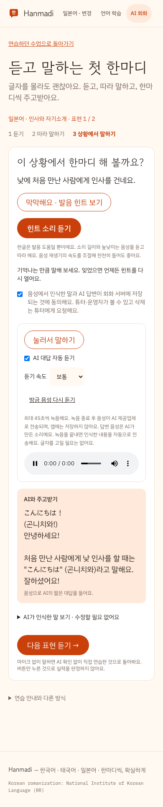
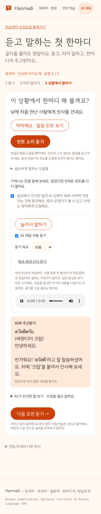

# Hanmadi 말하기 우선 학습 — 운영 적용 및 검증

검증일: 2026-09-28. 사용자가 승인한 PR #52 머지, Dify 지침 게시, Hanmadi 운영 배포를 수행했다.

## 적용 상태

- 운영: https://hanmadi-lake.vercel.app
- PR: https://github.com/hhj4861/commerce-automation-kit/pull/52 — MERGED
- 구현 커밋: `f90c8af489be37c841119035110818c119e273ce`
- main 머지: `a80e6f5185fd0e7ed0d2cc16a8186fb277f159ce`
- 배포: `dpl_8ox1T5YjaME6MjtZpm1s8p4pPiR3`, production READY
- 고정 배포 주소: https://hanmadi-4koo49mgc-dean-10.vercel.app
- Vercel deploy와 별도 inspect 모두 exit 0. 배포 소스의 `apps/hanmadi`, `services/dify`는 main과 일치했다.
- 이전 배포(되돌림 참고): `dpl_3YeHKRiJwmhZN9CHZHYmLRMNXLNq`

## 학습 흐름

일본어 또는 태국어 선택 → **처음이에요 · 듣고 말하기부터** → 학습 목표 선택 → **듣고 말하기 시작**.

한 수업에서 두 표현을 듣기 → 따라 말하기 → 상황에서 말하기 순서로 연습한다. 외국어 입력이나 문자 해독은 시작 조건이 아니다. 한글 발음 힌트, 느리게 듣기, 음성 인식 후 자동 전송을 제공한다. 마이크 없이 직접 연습했다는 기록도 가능하며, 이 기록을 객관적인 실력 평가나 자동 승급으로 취급하지 않는다. 어려웠던 표현은 복습 계획에 반영한다.

## Dify 게시

- 서버: 개인 GCP `replay-live-508202`, `shared-ai`, `us-central1-a`
- Hanmadi 앱: `2bd6d391-b119-40c4-b001-4be6bee368a9`
- 게시 전 workflow: `483a3344-24fd-4370-bc28-d5f3e008804f`
- 게시 후 workflow: `5642f7f2-e5a9-4bbd-a5df-1c94a44a935f` (`speaking-first-52`)
- 지침 SHA-256: `5fd12a317bd3276f4a66cb56d437b4be608736e250afb6fa228f585a73ea615a`
- 서버 DSL SHA-256: `a47ac75afc61f08877a955c301337af4b4d430d54e17a982f45b981eddcf282c`

기존 draft와 published graph/features가 같은지 먼저 확인했다. 승인된 DSL의 LLM prompt_template만 정상 콘솔 API로 저장·게시하고, 게시 결과의 나머지 graph/features가 보존됐는지 검증했다. 서버의 `services/dify/apps/hanmadi-tutor.yml`도 동기화했다. 전체 서버 저장소 갱신이나 컨테이너 재시작은 수행하지 않았다.

서버 비공개 백업: `/opt/shared-ai/backups/20260928-speaking-52` (디렉터리 0700, 파일 0600). 이전 workflow, draft, DSL 및 게시 후 workflow를 보관한다. 인증정보는 문서·Git에 기록하지 않았다.

## 실제 운영 E2E

정상 PIN 로그인과 테스트용 학생을 사용했다. Playwright Chromium에서 운영 API를 실제 호출했다. 마이크 입력은 운영 TTS로 만든 일본어/태국어 인사 음성을 WAV로 변환해 주입했다. STT·Dify·LLM·답변 TTS를 모킹하지 않았다.

| 항목 | 결과 |
| --- | --- |
| 일본어·태국어 완전 초보 시작, 쓰기 문제 없이 진입 | 통과 |
| 두 표현 × 따라 말하기/상황 말하기 × 두 언어 | 실제 STT·AI 8회 HTTP 200 |
| 한글 발음 힌트, 0.75배속 듣기 | 통과 |
| 새로고침 후 다음 표현 진행 유지 | 통과 |
| 어려움 기록, 주간 학습 계획 저장·재조회 | 통과 |
| beginner 유지, guided 연습이 자유 회화 횟수/문제 정답 수를 올리지 않음 | 통과 |
| 선택형 문제 접힘, 390px/1280px 가로 넘침 없음 | 통과 |
| 일본어 자유 회화 2회, Dify conversation ID 유지 | 통과 |
| 태국어 자유 회화 | 최초 검사에서 504 1회, 별도 재검사 2회 HTTP 200 및 conversation ID 유지 |

최초 종합 스크립트는 태국어 자유 회화의 504 때문에 **exit 1**이었다. 이를 전체 성공으로 처리하지 않았다. Vercel의 해당 배포 로그에서도 `/api/conversation` POST 504 1건을 확인했다. 재검사는 각각 2,545ms, 11,760ms에 정상 응답했으며 exit 0이었다. 당시 로그에 상세 원인이 없어 영구 해결됐다고 판정하지 않는다.

### AI 답변 음성 별도 확인

이전 audio 요소의 readyState가 남을 수 있으므로 그것만으로 새 음성 재생을 판정하지 않았다. 해당 답변의 `/api/conversation/speech` HTTP 200을 기다린 후, 생성 중 표시 종료·audio 표시·새 Blob 크기·디코딩·실제 currentTime 진행을 확인했다. 별도 검사 **exit 0**, 브라우저 pageerror 없음.

| 언어/단계 | 오디오 바이트 | 길이(초) | 확인 시 재생 위치(초) | 오류 |
| --- | ---: | ---: | ---: | --- |
| 일본어 따라 말하기 | 15,090 | 0.88 | 0.250 | 없음 |
| 일본어 상황 말하기 | 12,582 | 0.72 | 0.282 | 없음 |
| 태국어 따라 말하기 | 16,344 | 0.96 | 0.273 | 없음 |
| 태국어 상황 말하기 | 20,106 | 1.20 | 0.274 | 없음 |

## 자동 검사 및 정리

- 구현 단계: 단위 검사 28개, TypeScript, ESLint, 빌드, 로컬 E2E 통과. 로컬 E2E는 모의 공급자를 사용하며 실제 운영 검증과 구분한다.
- PR CI: Dify `36382360955`, Hanmadi `36382360972` 성공.
- main CI: Dify `36384043431`, Hanmadi `36384043465` 성공.
- 운영 검사 3회에서 생성한 테스트 학생 총 5명 삭제 API 모두 HTTP 200 / ok true. 각 검사 로그아웃 HTTP 200, 브라우저 종료, 임시 WAV/MP3 삭제 완료.
- 학습 이벤트와 Dify 대화는 기존 보관 정책에 따라 남을 수 있다. 기존 실제 학생을 변경하지 않았다.

## 검증 한계와 남은 품질 관찰

실제 사람의 마이크·휴대폰 브라우저·청음·발음 정확도는 검증하지 않았다. 합성 인사가 반복되는 입력에서도 답변이 생성되는 연결 검증이다. 타깃 언어 응답과 오디오 재생은 확인했지만 언어학적 정확성 전수 검수는 아니다.

태국어 자유 회화 재검사 2번째 응답에서는 한글 발음 도움말 자리에 태국어 원문이 반복됐다. 고정 학습 표현의 힌트와 달리 생성형 자유 회화의 발음 표기 일관성은 후속 개선 대상으로 남긴다. 또한 504가 재현되지 않았다는 사실만으로 지연 문제가 해결됐다고 보지 않는다.
