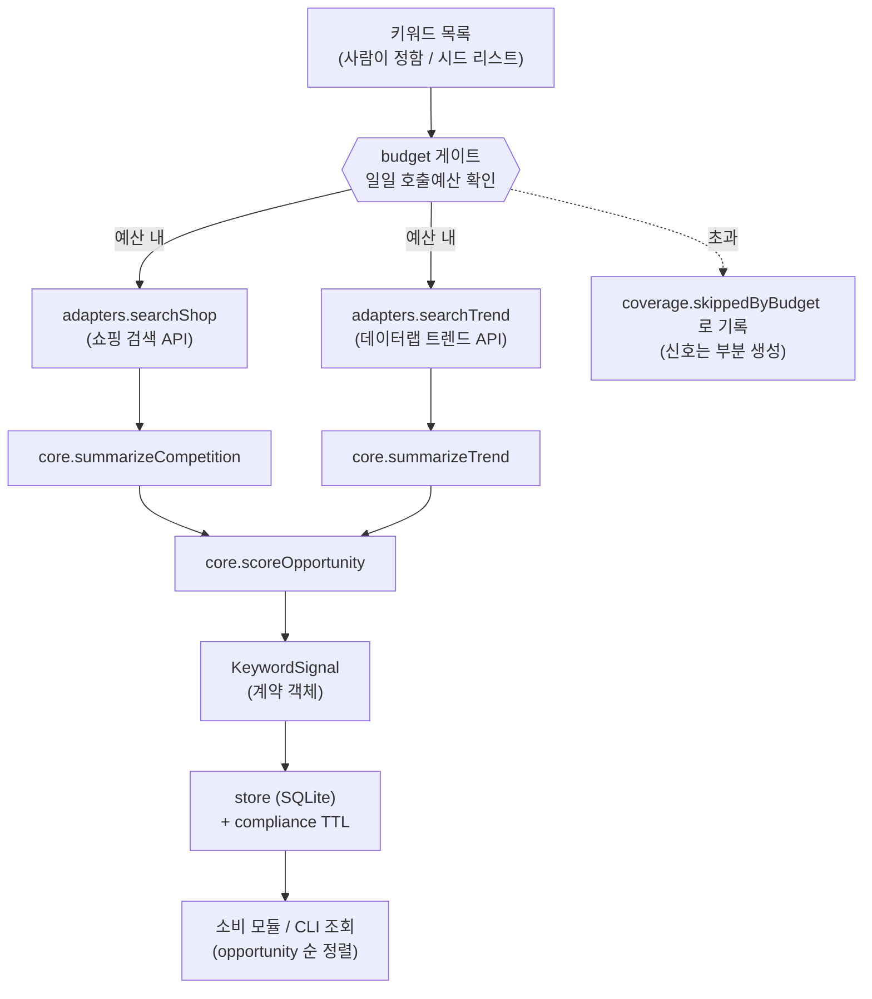

# ARCHITECTURE — commerce-keyword-intel

**작성일:** 2026-07-23 · 대상 모듈: 합법 유틸리티 원자 #1 (네이버 API 커머스 인텔리전스)

> 설계 원칙은 blueprint-review 재설계 문서의 결론을 따른다:
> **4레이어 MSA/이벤트버스 폐기 → 모놀리식 + 큐 1개 + 크론 + 코드패키지 경계.**
> 1인~소수 규모에서 MSA는 과잉설계이며, 계정/한도 단위 SPOF를 분산으로 못 막는다.

---

## 1. 설계 목표와 비목표

| 목표 | 비목표 |
|---|---|
| 네이버 공식 API로 키워드 경쟁·수요 신호를 **안정적·합법적**으로 산출 | 실시간 대량 모니터링 SaaS (약관 제약, LEGAL-BOUNDARY) |
| 다른 모듈이 **계약 하나로 조합**할 수 있는 명확한 출력 인터페이스 | 콘텐츠 생성/배포/커머스 연동 (별도 원자) |
| API 한도·결측을 **투명하게** 다루기(silent drop 금지) | "무엇을 만들지" 자동 결정(낙수 트리거 — 반증됨) |
| 테스트 가능한 순수 코어 | 완전 무인화 |

---

## 2. 컴포넌트 구조 (코드패키지 경계)

```
(계약은 모노레포 공용 패키지로 이동: packages/contracts/src/keyword-signal.ts — @cak/contracts)
src/
├── adapters/            # 외부 I/O 경계. 네이버 공식 API만. 스크래핑 금지.
│   └── naver-client.ts       → searchShop(), searchTrend(), NaverApiError
├── core/                # 순수 로직. I/O 없음 → 단위테스트 용이.
│   └── analyzer.ts           → summarizeCompetition/Trend, scoreOpportunity
├── cli/                 # 얇은 실행 껍데기 + 라이브러리 진입점
│   ├── index.ts              → argv 파싱
│   └── collect.ts            → collectSignals()  ★조합 시 이 함수만 호출
└── (Phase 2 추가)
    ├── store/                → SQLite 영속화 + 한도 카운터
    ├── budget/               → 일일 호출예산 영속 게이트
    └── obs/                  → 구조화 로깅·재시도·DLQ·알림
```

**의존 방향(단방향):** `cli → core → contracts` 및 `cli → adapters → contracts`.
core 는 adapters 를 import 하지 않는다(응답을 인자로 받음) → 코어 테스트에 네트워크 불필요.

---

## 3. 데이터 흐름



**핵심 규약**
- 트렌드(데이터랩)는 한도가 더 빡빡(D1-3 확정 1,000/일)하므로 **선택적**. 실패해도 신호 전체를 죽이지 않고 `coverage.ok.naver_datalab_search=false` 로 투명화한다.
- 한도 초과는 예외가 아니라 `skippedByBudget` 로 **1급 시민**처럼 다룬다.
- 모든 실패 키워드는 `IntelBatch.failures` 에 사유와 함께 남긴다(silent drop 금지 — blueprint-review가 지적한 안티패턴 회피).

---

## 4. 스코어 정의 (참고 지표, 자동 트리거 아님)

> ⚠️ v0 정의는 플레이스홀더다. 실측 데이터로 캘리브레이션하기 전까지 `confidence` 에 0.7 상한을 둔다.
> 스코어는 **사람이 상품을 기획할 때 참고**하는 값이며, 제조/매수를 자동 실행하지 않는다.

| 필드 | v0 정의 | 튜닝 계획 |
|---|---|---|
| `competition.totalProducts` | 쇼핑 검색 `total` | 그대로(원지표) |
| `competition.distinctSellers` | 상위 결과 mallName 고유 수 | display 크기 민감도 실측 |
| `trend.momentumPct` | 최근 절반 평균 vs 직전 절반 평균 변화율 | 계절성 보정 검토 |
| `scores.opportunity` | `demand*0.6 + (100 - log10(total)/7*100)*0.4` | 실판매 데이터와 상관 검증 후 가중치 재조정 |
| `scores.confidence` | 소스 성공 조합(≤0.7) | 캘리브레이션 후 상한 해제 |

**opportunity 의 의미:** 높을수록 "수요는 있는데 경쟁이 덜한" 키워드. 낮으면 레드오션 혹은 무수요.
이 값이 높다고 사업이 되는 것은 아니다 — 원안 검증(NO-GO)이 보여줬듯 **수요·경쟁 지표와 실제 수익은 별개**다.

---

## 5. 기술 선택과 근거

| 선택 | 이유 |
|---|---|
| **TypeScript + Node 20** | 조합 전략의 핵심이 "명확한 인터페이스 계약". 타입이 계약을 컴파일 타임에 강제. 원안 로드맵도 Node 기반 |
| **undici** (fetch 계열) | 의존성 가볍고 표준적. axios 불필요 |
| **zod** | 네이버 응답을 계약으로 변환할 때 런타임 검증(외부 API는 스키마가 바뀔 수 있음) |
| **better-sqlite3** | 1인 규모에 Postgres는 과함. 파일 DB로 시작, 스케일 시 교체 가능하게 store 인터페이스 분리 |
| **p-limit** | 네이버 QPS 방어(동시성 상한). 한도 관리의 1차 방어선 |
| **모놀리식** | MSA 폐기 원칙. 큐 1개(내부) + 크론이면 충분 |

**의도적으로 넣지 않은 것:** 메시지버스, 마이크로서비스, 쿠버네티스, GPU 렌더러 — 이 모듈엔 불필요.

---

## 6. 관측성·신뢰성 (Phase 2 필수 레이어)

blueprint-review가 원안의 결함으로 지적한 "silent cap / 장애 전파"를 구조로 방지한다.

- **구조화 로깅**: 모든 API 호출에 `{keyword, api, status, latency, callsSpentToday}` 기록
- **재시도 + 백오프**: 429/5xx는 지수 백오프 재시도, 한도성 429는 재시도 대신 즉시 예산 중단
- **DLQ**: 반복 실패 키워드는 dead-letter로 격리 후 배치 말미에 리포트
- **알림**: 일일 예산 80% 도달, 인증 실패(401), 응답 스키마 불일치 시 알림

---

## 7. 확장 시나리오 (지금 만들지 않음, 경계만 표시)

| 확장 | 가능? | 조건 |
|---|---|---|
| 셀러에게 키워드 리포트 **판매** | ⚠️ 조건부 | 네이버 약관의 데이터 재판매 제한 확인 필수 → LEGAL-BOUNDARY. 원본 재판매가 아닌 **가공 인사이트**로 한정될 가능성 |
| 데이터랩 **쇼핑인사이트**(분야별 클릭추이) 추가 | ✅ | 공식 API. 카테고리 코드 매핑 D1에 추가 |
| 다른 원자(렌더러)와 조합 | ✅ | KeywordSignal 계약으로 연결. 렌더러 입력은 라이선스 소스만 |
| **질문 마이닝**(지식iN 검색 API 등 실수요 질문 신호) | ⚠️ 조건부 | 공식 API만(HTML 파싱 금지)·착수 조건 있음 → [QUESTION-MINING.md](./QUESTION-MINING.md). 채널별(광고/블로그/쇼츠) 검색 분리는 기각 — 동 문서 §2 ADR |
| 실시간 모니터링 대시보드 SaaS | ❌ 보류 | 약관상 "모니터링 서비스" 제한 소지(재설계 문서 지적). 실측 전 금지 |
